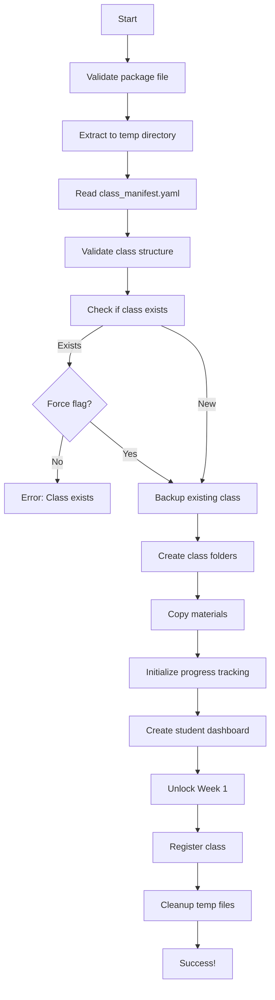

# import_class.py - Class Import Script

**Purpose:** Import packaged OCDS classes into an Obsidian vault

**Last Updated:** 2025-11-06  
**OCDS Version:** 1.0.0

---

## 📋 Overview

The `import_class.py` script is the **entry point** for students to import OCDS classes into their Obsidian vault. It handles extracting class packages, setting up folder structures, initializing progress tracking, and unlocking Week 1.

### What This Script Does

1. ✅ **Extracts class package** - Unzips `.zip` file
2. ✅ **Validates structure** - Checks for required files
3. ✅ **Creates folders** - Sets up class directory
4. ✅ **Copies materials** - Moves files to correct locations
5. ✅ **Initializes progress** - Creates student progress tracking
6. ✅ **Unlocks Week 1** - Makes first week accessible
7. ✅ **Sets up dashboard** - Creates progress dashboard
8. ✅ **Registers class** - Adds to student's class list

---

## 🎯 When to Use

**Students use this script when:**
- Importing a new class for the first time
- Re-importing a class after updates
- Setting up a class on a new device

**Instructors use this script when:**
- Testing a class package before distribution
- Importing a class to review/grade student work
- Setting up demo/example classes

---

## 🚀 Quick Start

### Basic Usage

```bash
python import_class.py --package TCM_101.zip --student-id john_doe
```

### With Options

```bash
python import_class.py \
  --package TCM_101.zip \
  --student-id john_doe \
  --vault-path "/path/to/vault" \
  --force
```

---

## 📖 Command Line Arguments

### Required Arguments

| Argument | Description | Example |
|----------|-------------|---------|
| `--package` | Path to class `.zip` file | `--package TCM_101.zip` |
| `--student-id` | Unique student identifier | `--student-id john_doe` |

### Optional Arguments

| Argument | Description | Default | Example |
|----------|-------------|---------|---------|
| `--vault-path` | Path to Obsidian vault | Current directory | `--vault-path /path/to/vault` |
| `--classes-folder` | Folder for classes | `Classes` | `--classes-folder MyCourses` |
| `--force` | Overwrite existing class | `False` | `--force` |
| `--no-unlock` | Don't unlock Week 1 | `False` | `--no-unlock` |
| `--dry-run` | Preview without importing | `False` | `--dry-run` |
| `--verbose` | Detailed output | `False` | `--verbose` or `-v` |
| `--quiet` | Minimal output | `False` | `--quiet` or `-q` |

---

## 🏗️ How It Works

### Import Process Flow



---

## 📁 Class Package Structure

### Expected Package Contents

```
TCM_101.zip
├── class_manifest.yaml       # Required: Class metadata
├── timeline.yaml              # Required: Week/day structure
├── grading_config.yaml        # Required: Grading rules
├── question_bank.yaml         # Required: Quiz questions
├── Materials/                 # Required: Course content
│   ├── Week_01/
│   │   ├── Study_Material.md
│   │   ├── Flashcards.md
│   │   ├── Quiz.md
│   │   ├── Homework.md
│   │   ├── Slides.md
│   │   └── Tasks.md
│   ├── Week_02/
│   │   └── [same structure]
│   └── [... weeks 3-12]
├── Images/                    # Optional: Course images
│   ├── diagrams/
│   ├── photos/
│   └── illustrations/
├── Resources/                 # Optional: Extra resources
│   ├── PDFs/
│   ├── Videos/
│   └── Links.md
└── README.md                  # Optional: Class info
```

---

## 🔧 Script Implementation

### Main Function

```python
#!/usr/bin/env python3
"""
import_class.py - OCDS Class Import Script

Imports packaged OCDS classes into Obsidian vault.
"""

import os
import sys
import zipfile
import shutil
import yaml
import click
from pathlib import Path
from datetime import datetime
from typing import Dict, Any, Optional

# Import utilities
from utils.frontmatter_parser import parse_frontmatter, update_frontmatter
from utils.yaml_loader import load_yaml, save_yaml
from utils.file_generator import create_file_from_template
from utils.logger import setup_logger

logger = setup_logger(__name__)


@click.command()
@click.option('--package', required=True, type=click.Path(exists=True),
              help='Path to class .zip package')
@click.option('--student-id', required=True,
              help='Unique student identifier')
@click.option('--vault-path', type=click.Path(),
              default='.', help='Path to Obsidian vault')
@click.option('--classes-folder', default='Classes',
              help='Folder name for classes')
@click.option('--force', is_flag=True,
              help='Overwrite existing class')
@click.option('--no-unlock', is_flag=True,
              help='Do not unlock Week 1')
@click.option('--dry-run', is_flag=True,
              help='Preview without importing')
@click.option('--verbose', '-v', is_flag=True,
              help='Verbose output')
@click.option('--quiet', '-q', is_flag=True,
              help='Minimal output')
def import_class(package: str, student_id: str, vault_path: str,
                classes_folder: str, force: bool, no_unlock: bool,
                dry_run: bool, verbose: bool, quiet: bool):
    """Import an OCDS class package into Obsidian vault."""
    
    # Setup
    vault_path = Path(vault_path).resolve()
    package_path = Path(package).resolve()
    
    if not quiet:
        print_header("OCDS Class Import")
        print(f"Package: {package_path.name}")
        print(f"Student: {student_id}")
        print(f"Vault: {vault_path}")
        print()
    
    try:
        # Step 1: Validate package
        if verbose:
            logger.info("Validating package...")
        validate_package(package_path)
        
        # Step 2: Extract to temp directory
        if verbose:
            logger.info("Extracting package...")
        temp_dir = extract_package(package_path)
        
        # Step 3: Read manifest
        if verbose:
            logger.info("Reading class manifest...")
        manifest = load_yaml(temp_dir / 'class_manifest.yaml')
        class_id = manifest['class_id']
        
        # Step 4: Validate structure
        if verbose:
            logger.info("Validating class structure...")
        validate_class_structure(temp_dir, manifest)
        
        # Step 5: Check if class exists
        class_dir = vault_path / classes_folder / class_id
        if class_dir.exists() and not force:
            raise FileExistsError(
                f"Class {class_id} already exists. Use --force to overwrite."
            )
        
        # Step 6: Backup existing class (if force)
        if class_dir.exists() and force:
            if verbose:
                logger.info("Backing up existing class...")
            backup_class(class_dir)
        
        if dry_run:
            print("\n✅ Dry run complete. No changes made.")
            return
        
        # Step 7: Create class folders
        if verbose:
            logger.info("Creating class folders...")
        create_class_folders(class_dir, manifest)
        
        # Step 8: Copy materials
        if verbose:
            logger.info("Copying materials...")
        copy_materials(temp_dir, class_dir)
        
        # Step 9: Initialize progress tracking
        if verbose:
            logger.info("Initializing progress tracking...")
        initialize_progress(class_dir, student_id, manifest)
        
        # Step 10: Create dashboard
        if verbose:
            logger.info("Creating student dashboard...")
        create_dashboard(class_dir, student_id, manifest)
        
        # Step 11: Unlock Week 1
        if not no_unlock:
            if verbose:
                logger.info("Unlocking Week 1...")
            unlock_week(class_dir, student_id, week=1)
        
        # Step 12: Register class
        if verbose:
            logger.info("Registering class...")
        register_class(vault_path, class_id, student_id)
        
        # Step 13: Cleanup
        if verbose:
            logger.info("Cleaning up...")
        shutil.rmtree(temp_dir)
        
        # Success!
        if not quiet:
            print_success(manifest, class_dir)
        
    except Exception as e:
        logger.error(f"Import failed: {e}")
        if verbose:
            raise
        else:
            print(f"\n❌ Error: {e}")
            sys.exit(1)


def validate_package(package_path: Path) -> None:
    """Validate package file exists and is a valid zip."""
    if not package_path.exists():
        raise FileNotFoundError(f"Package not found: {package_path}")
    
    if not zipfile.is_zipfile(package_path):
        raise ValueError(f"Invalid zip file: {package_path}")


def extract_package(package_path: Path) -> Path:
    """Extract package to temporary directory."""
    import tempfile
    
    temp_dir = Path(tempfile.mkdtemp(prefix='ocds_import_'))
    
    with zipfile.ZipFile(package_path, 'r') as zip_ref:
        zip_ref.extractall(temp_dir)
    
    return temp_dir


def validate_class_structure(class_dir: Path, manifest: Dict[str, Any]) -> None:
    """Validate class has required files and structure."""
    
    required_files = [
        'class_manifest.yaml',
        'timeline.yaml',
        'grading_config.yaml',
        'question_bank.yaml'
    ]
    
    for file in required_files:
        if not (class_dir / file).exists():
            raise FileNotFoundError(f"Required file missing: {file}")
    
    # Check Materials folder
    materials_dir = class_dir / 'Materials'
    if not materials_dir.exists():
        raise FileNotFoundError("Materials folder missing")
    
    # Validate weeks exist
    timeline = load_yaml(class_dir / 'timeline.yaml')
    for week in timeline['weeks']:
        week_num = week['week']
        week_dir = materials_dir / f"Week_{week_num:02d}"
        if not week_dir.exists():
            raise FileNotFoundError(f"Week {week_num} materials missing")


def create_class_folders(class_dir: Path, manifest: Dict[str, Any]) -> None:
    """Create class folder structure."""
    
    folders = [
        class_dir,
        class_dir / 'Materials',
        class_dir / 'Progress',
        class_dir / 'Dashboards',
        class_dir / 'Resources'
    ]
    
    for folder in folders:
        folder.mkdir(parents=True, exist_ok=True)


def copy_materials(source_dir: Path, dest_dir: Path) -> None:
    """Copy materials from temp directory to class directory."""
    
    # Copy config files
    config_files = [
        'class_manifest.yaml',
        'timeline.yaml',
        'grading_config.yaml',
        'question_bank.yaml'
    ]
    
    for file in config_files:
        src = source_dir / file
        dst = dest_dir / file
        if src.exists():
            shutil.copy2(src, dst)
    
    # Copy Materials folder
    src_materials = source_dir / 'Materials'
    dst_materials = dest_dir / 'Materials'
    if src_materials.exists():
        shutil.copytree(src_materials, dst_materials, dirs_exist_ok=True)
    
    # Copy Images folder (if exists)
    src_images = source_dir / 'Images'
    dst_images = dest_dir / 'Images'
    if src_images.exists():
        shutil.copytree(src_images, dst_images, dirs_exist_ok=True)
    
    # Copy Resources folder (if exists)
    src_resources = source_dir / 'Resources'
    dst_resources = dest_dir / 'Resources'
    if src_resources.exists():
        shutil.copytree(src_resources, dst_resources, dirs_exist_ok=True)
    
    # Copy README (if exists)
    src_readme = source_dir / 'README.md'
    dst_readme = dest_dir / 'README.md'
    if src_readme.exists():
        shutil.copy2(src_readme, dst_readme)


def initialize_progress(class_dir: Path, student_id: str,
                       manifest: Dict[str, Any]) -> None:
    """Initialize student progress tracking file."""
    
    progress_file = class_dir / 'Progress' / f'{student_id}_progress.yaml'
    
    progress_data = {
        'student_id': student_id,
        'class_id': manifest['class_id'],
        'class_title': manifest['title'],
        'enrolled_date': datetime.now().strftime('%Y-%m-%d'),
        'current_week': 1,
        'overall_grade': 0.0,
        'weeks': {},
        'quizzes': {},
        'homework': {},
        'flashcards': {},
        'tasks': {},
        'pomodoros': {
            'total_sessions': 0,
            'total_minutes': 0
        }
    }
    
    save_yaml(progress_file, progress_data)


def create_dashboard(class_dir: Path, student_id: str,
                    manifest: Dict[str, Any]) -> None:
    """Create student progress dashboard."""
    
    dashboard_file = class_dir / 'Dashboards' / f'{student_id}_dashboard.md'
    
    template = f"""---
ocds_type: dashboard
class_id: {manifest['class_id']}
student_id: {student_id}
---

# {manifest['title']} - Progress Dashboard

**Student:** {student_id}  
**Enrolled:** {{{{date}}}}  
**Current Week:** `VIEW{{current_week}}`  
**Overall Grade:** `VIEW{{overall_grade}}`%

---

## 📊 Grade Summary

```dataview
TABLE
  grade_component as "Component",
  weight as "Weight",
  score as "Score",
  weighted_score as "Weighted"
FROM "[[]]"
WHERE ocds_type = "grade_summary"
```

**Final Grade:** `VIEW{{overall_grade}}`% (`VIEW{{letter_grade}}`)

---

## 📅 Weekly Progress

```dataview
TABLE
  week as "Week",
  title as "Topic",
  status as "Status",
  quiz_score as "Quiz",
  homework_score as "HW",
  completion as "Complete"
FROM "{class_dir}/Materials"
WHERE ocds_type = "week"
SORT week ASC
```

---

## ✅ Current Week Tasks

```dataview
TASK
FROM "{class_dir}/Materials"
WHERE week = {{{{current_week}}}} AND !completed
```

---

## 🎯 Next Steps

- [ ] Complete current week materials
- [ ] Review flashcards daily
- [ ] Submit homework on time
- [ ] Maintain study schedule

---

*Dashboard auto-updates as you complete materials*
"""
    
    dashboard_file.write_text(template)


def unlock_week(class_dir: Path, student_id: str, week: int) -> None:
    """Unlock a specific week for student."""
    
    progress_file = class_dir / 'Progress' / f'{student_id}_progress.yaml'
    progress = load_yaml(progress_file)
    
    # Update current week
    progress['current_week'] = week
    
    # Mark week as unlocked
    if 'weeks' not in progress:
        progress['weeks'] = {}
    
    progress['weeks'][week] = {
        'unlocked': True,
        'unlocked_date': datetime.now().strftime('%Y-%m-%d'),
        'status': 'in_progress'
    }
    
    save_yaml(progress_file, progress)
    
    # Update material frontmatter
    week_dir = class_dir / 'Materials' / f'Week_{week:02d}'
    for material_file in week_dir.glob('*.md'):
        frontmatter = parse_frontmatter(material_file)
        frontmatter['unlocked'] = True
        frontmatter['unlock_date'] = datetime.now().strftime('%Y-%m-%d')
        update_frontmatter(material_file, frontmatter)


def register_class(vault_path: Path, class_id: str, student_id: str) -> None:
    """Register class in student's class list."""
    
    classes_file = vault_path / 'my_classes.yaml'
    
    if classes_file.exists():
        classes = load_yaml(classes_file)
    else:
        classes = {'classes': []}
    
    # Add class if not already registered
    if class_id not in [c['class_id'] for c in classes['classes']]:
        classes['classes'].append({
            'class_id': class_id,
            'student_id': student_id,
            'enrolled_date': datetime.now().strftime('%Y-%m-%d'),
            'status': 'active'
        })
        
        save_yaml(classes_file, classes)


def backup_class(class_dir: Path) -> None:
    """Backup existing class before overwriting."""
    
    backup_dir = class_dir.parent / f"{class_dir.name}_backup_{datetime.now().strftime('%Y%m%d_%H%M%S')}"
    shutil.copytree(class_dir, backup_dir)
    logger.info(f"Backed up to: {backup_dir}")


def print_header(title: str) -> None:
    """Print formatted header."""
    print()
    print("=" * 60)
    print(f"  {title}")
    print("=" * 60)


def print_success(manifest: Dict[str, Any], class_dir: Path) -> None:
    """Print success message."""
    print()
    print("✅ Import Complete!")
    print()
    print(f"Class: {manifest['title']}")
    print(f"Location: {class_dir}")
    print(f"Weeks: {manifest['total_weeks']}")
    print(f"Status: Week 1 unlocked")
    print()
    print("Next steps:")
    print("  1. Open Obsidian")
    print(f"  2. Navigate to: {class_dir}")
    print("  3. Start with Week 1 materials")
    print()


if __name__ == '__main__':
    import_class()
```

---

## 📊 Example Usage

### Example 1: Basic Import

```bash
python import_class.py --package TCM_101.zip --student-id john_doe
```

**Output:**
```
============================================================
  OCDS Class Import
============================================================
Package: TCM_101.zip
Student: john_doe
Vault: /Users/john/ObsidianVault

✅ Import Complete!

Class: Traditional Chinese Medicine Fundamentals
Location: /Users/john/ObsidianVault/Classes/TCM_101
Weeks: 12
Status: Week 1 unlocked

Next steps:
  1. Open Obsidian
  2. Navigate to: /Users/john/ObsidianVault/Classes/TCM_101
  3. Start with Week 1 materials
```

---

### Example 2: Import with Custom Vault Path

```bash
python import_class.py \
  --package TCM_101.zip \
  --student-id john_doe \
  --vault-path "/Users/john/Documents/MyVault"
```

---

### Example 3: Force Overwrite Existing Class

```bash
python import_class.py \
  --package TCM_101_v2.zip \
  --student-id john_doe \
  --force
```

**Output:**
```
Backing up existing class to: Classes/TCM_101_backup_20250106_143022
✅ Import Complete!
```

---

### Example 4: Dry Run (Preview)

```bash
python import_class.py \
  --package TCM_101.zip \
  --student-id john_doe \
  --dry-run
```

**Output:**
```
[Validation checks...]
✅ Dry run complete. No changes made.
```

---

### Example 5: Verbose Output

```bash
python import_class.py \
  --package TCM_101.zip \
  --student-id john_doe \
  --verbose
```

**Output:**
```
INFO: Validating package...
INFO: Extracting package...
INFO: Reading class manifest...
INFO: Validating class structure...
INFO: Creating class folders...
INFO: Copying materials...
INFO: Initializing progress tracking...
INFO: Creating student dashboard...
INFO: Unlocking Week 1...
INFO: Registering class...
INFO: Cleaning up...
✅ Import Complete!
```

---

## 🔍 Troubleshooting

### Common Errors

**Error:** `Package not found: TCM_101.zip`  
**Solution:** Check file path. Use absolute path or ensure you're in correct directory.

**Error:** `Invalid zip file`  
**Solution:** Re-download package. File may be corrupted.

**Error:** `Required file missing: timeline.yaml`  
**Solution:** Package is incomplete. Contact instructor for valid package.

**Error:** `Class TCM_101 already exists`  
**Solution:** Use `--force` flag to overwrite, or manually delete existing class folder.

**Error:** `Permission denied`  
**Solution:** Check folder permissions. Ensure you have write access to vault directory.

**Error:** `Week 1 materials missing`  
**Solution:** Package structure is invalid. Verify package contents.

---

## 🎯 Best Practices

### For Students

- ✅ **Backup vault** - Before importing, backup your vault
- ✅ **Check package** - Verify package is from trusted source
- ✅ **Use dry-run** - Preview import with `--dry-run` first
- ✅ **Unique student ID** - Use consistent student ID across classes
- ✅ **Check output** - Review import success message

### For Instructors

- ✅ **Test packages** - Import and test before distributing
- ✅ **Version packages** - Use version numbers in filenames
- ✅ **Provide checksums** - Include MD5/SHA256 for verification
- ✅ **Document changes** - Include changelog in README
- ✅ **Support students** - Provide clear import instructions

---

## 📚 Related Documentation

- [[Script_Overview.md]] - All automation scripts
- [[Class_Manifest_Schema.md]] - Manifest file format
- [[Timeline_Schema.md]] - Timeline file format
- [[Progress_Tracking_Schema.md]] - Progress tracking format

---

**This script is the gateway to OCDS. Make importing seamless!**

---

*Last updated: 2025-11-06*  
*OCDS Version: 1.0.0*
