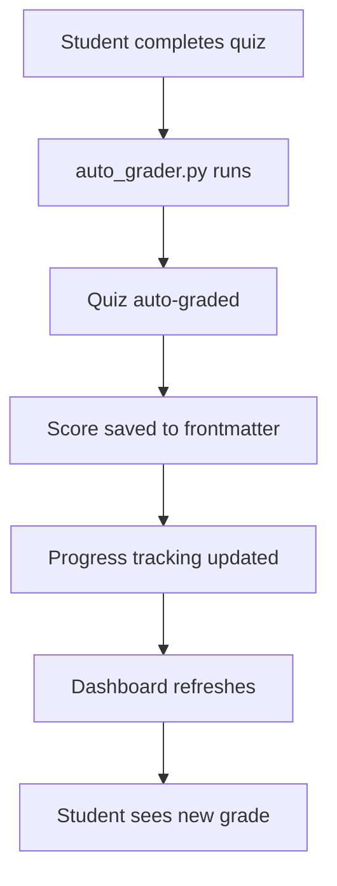
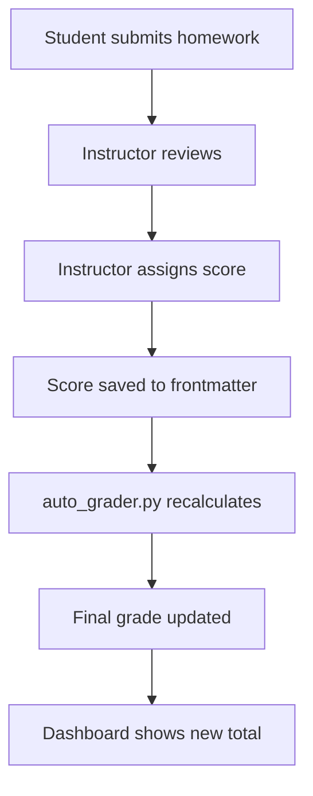

# Auto-Grading Overview

**Purpose:** Complete overview of the OCDS auto-grading system

**Last Updated:** 2025-11-06  
**OCDS Version:** 1.0.0

---

## 📋 Overview

The OCDS auto-grading system automatically calculates student grades from multiple assessment types. It combines auto-graded quizzes, activity tracking (flashcards, tasks, pomodoros), and manually-graded homework into a weighted final grade.

### Key Features

- ✅ **Automatic quiz grading** - Instant feedback on multiple choice
- ✅ **Activity tracking** - Monitors flashcard completion, tasks, study time
- ✅ **Weighted scoring** - Configurable weights per component
- ✅ **Real-time updates** - Grades update as students complete work
- ✅ **Transparent calculations** - Students see how grades are calculated
- ✅ **Flexible configuration** - Instructors customize grading rules

---

## 🎯 Grading Components

### Default Grading Breakdown

| Component | Weight | Auto-Graded | Description |
|-----------|--------|-------------|-------------|
| **Quizzes** | 40% | ✅ Yes | Multiple choice quizzes |
| **Flashcards** | 30% | ✅ Yes | Spaced repetition completion |
| **Homework** | 20% | ❌ No | Manual instructor grading |
| **Tasks** | 10% | ✅ Yes | Checklist completion |

**Total:** 100%

---

## 🔄 Grading Workflow

### Student Perspective



### Instructor Perspective



---

## 📊 Grade Calculation Formula

### Final Grade Calculation

```python
final_grade = (
    quiz_average * quiz_weight +
    flashcard_score * flashcard_weight +
    homework_average * homework_weight +
    task_completion * task_weight
)
```

### Example Calculation

**Student Scores:**
- Quizzes: 85% average
- Flashcards: 90% completion
- Homework: 88% average
- Tasks: 95% completion

**Weights (default):**
- Quizzes: 40% (0.40)
- Flashcards: 30% (0.30)
- Homework: 20% (0.20)
- Tasks: 10% (0.10)

**Calculation:**
```
Final Grade = (85 × 0.40) + (90 × 0.30) + (88 × 0.20) + (95 × 0.10)
            = 34.0 + 27.0 + 17.6 + 9.5
            = 88.1%
```

**Letter Grade:** B+

---

## 🏗️ Grading Architecture

### Data Flow

```
┌─────────────────────────────────────────────────────────┐
│                    Student Materials                     │
│  (Quizzes, Flashcards, Homework, Tasks)                 │
└────────────────────┬────────────────────────────────────┘
                     │
                     ▼
┌─────────────────────────────────────────────────────────┐
│              Material Frontmatter                        │
│  (score, completion, graded_date)                       │
└────────────────────┬────────────────────────────────────┘
                     │
                     ▼
┌─────────────────────────────────────────────────────────┐
│              auto_grader.py                              │
│  - Reads material frontmatter                           │
│  - Calculates component averages                        │
│  - Applies weights                                      │
│  - Calculates final grade                              │
└────────────────────┬────────────────────────────────────┘
                     │
                     ▼
┌─────────────────────────────────────────────────────────┐
│         progress_tracking.yaml                           │
│  - Stores all scores                                    │
│  - Tracks component averages                            │
│  - Records final grade                                  │
└────────────────────┬────────────────────────────────────┘
                     │
                     ▼
┌─────────────────────────────────────────────────────────┐
│            Student Dashboard                             │
│  - Displays current grades                              │
│  - Shows grade breakdown                                │
│  - Visualizes progress                                  │
└─────────────────────────────────────────────────────────┘
```

---

## ⚙️ Configuration

### grading_config.yaml

```yaml
# Grading Configuration for TCM_101

# Component Weights (must sum to 1.0)
weights:
  quizzes: 0.40      # 40%
  flashcards: 0.30   # 30%
  homework: 0.20     # 20%
  tasks: 0.10        # 10%

# Quiz Grading
quiz_grading:
  passing_score: 70
  allow_retakes: true
  max_attempts: 3
  score_method: best  # best, average, last

# Flashcard Grading
flashcard_grading:
  completion_threshold: 80  # % of cards to complete
  accuracy_weight: 0.5      # 50% completion, 50% accuracy
  min_reviews: 3            # Minimum reviews per card

# Homework Grading
homework_grading:
  late_penalty: 10          # 10% per day
  max_late_days: 3
  allow_resubmission: true
  max_resubmissions: 2

# Task Grading
task_grading:
  required_only: false      # Include optional tasks
  bonus_points: true        # Allow bonus points

# Letter Grades
letter_grades:
  A: 93
  A-: 90
  B+: 87
  B: 83
  B-: 80
  C+: 77
  C: 73
  C-: 70
  D: 60
  F: 0

# Grade Display
display:
  show_percentages: true
  show_letter_grades: true
  show_component_breakdown: true
  decimal_places: 1
```

---

## 📈 Grading Policies

### Quiz Retakes

**Policy:** Students can retake quizzes up to 3 times

**Scoring Methods:**
- **Best score** (default) - Highest score counts
- **Average** - Average of all attempts
- **Last attempt** - Most recent score counts

**Example:**
```
Attempt 1: 75%
Attempt 2: 85%
Attempt 3: 80%

Best score: 85%
Average: 80%
Last attempt: 80%
```

---

### Late Submissions

**Policy:** Late homework accepted with penalty

**Penalty Calculation:**
```python
days_late = (submission_date - due_date).days
penalty_percent = min(days_late * late_penalty, 100)
final_score = raw_score * (1 - penalty_percent / 100)
```

**Example:**
```
Raw score: 90%
Days late: 2
Penalty: 10% per day = 20% total
Final score: 90% × 0.80 = 72%
```

---

### Bonus Points

**Policy:** Optional tasks and bonus questions add extra credit

**Calculation:**
```python
# Tasks with bonus
required_points = 7
bonus_points = 3
total_possible = 10

student_earned = 9  # Completed all required + 2 bonus
percentage = (9 / 10) * 100 = 90%
```

**Note:** Bonus points can exceed 100% for individual components, but final grade is capped at 100%.

---

## 🎯 Grading Best Practices

### For Instructors

**Setting Weights:**
- ✅ **Align with learning goals** - Weight what matters most
- ✅ **Balance assessment types** - Mix objective and subjective
- ✅ **Consider student workload** - Don't overweight any one component
- ✅ **Test your weights** - Calculate sample grades before finalizing

**Grading Homework:**
- ✅ **Use rubrics** - Consistent, transparent grading
- ✅ **Grade promptly** - Within 1 week of submission
- ✅ **Provide feedback** - Not just scores, explain why
- ✅ **Be consistent** - Same standards for all students

**Communicating Grades:**
- ✅ **Explain the system** - Students should understand how grades work
- ✅ **Show calculations** - Transparent grade breakdowns
- ✅ **Update regularly** - Keep dashboards current
- ✅ **Respond to questions** - Address grade concerns promptly

---

### For Students

**Maximizing Your Grade:**
- ✅ **Complete all components** - Don't skip any assessment type
- ✅ **Retake quizzes** - Use retakes to improve scores
- ✅ **Review flashcards regularly** - Consistency matters
- ✅ **Submit homework on time** - Avoid late penalties
- ✅ **Complete bonus tasks** - Easy way to boost grade

**Understanding Your Grade:**
- ✅ **Check dashboard regularly** - Monitor your progress
- ✅ **Review component breakdown** - See where you're strong/weak
- ✅ **Calculate your own grade** - Verify accuracy
- ✅ **Ask questions** - If something seems wrong, ask!

---

## 🔍 Troubleshooting

### Common Issues

**Issue:** "My grade doesn't match my calculations"  
**Solution:** Check that all components are included. Verify weights sum to 1.0. Look for late penalties.

**Issue:** "Quiz score not updating"  
**Solution:** Make sure quiz frontmatter has `score` field. Run `auto_grader.py` manually.

**Issue:** "Homework grade missing from total"  
**Solution:** Instructor must enter score in homework frontmatter. Check `graded_date` field.

**Issue:** "Flashcard completion shows 0%"  
**Solution:** Ensure flashcards are being reviewed in Spaced Repetition plugin. Check review logs.

**Issue:** "Final grade over 100%"  
**Solution:** Bonus points may push individual components over 100%. Final grade should be capped at 100%.

---

## 📚 Related Documentation

- [[Quiz_Grading.md]] - Quiz grading details
- [[Activity_Tracking.md]] - Flashcards, tasks, pomodoros
- [[Grading_Weights.md]] - Weight configuration
- [[Grade_Reports.md]] - Reports and dashboards
- [[auto_grader.py.md]] - Grading script
- [[Grading_Config_Schema.md]] - Configuration format

---

## 📊 Grade Statistics

### Class-Wide Statistics

Instructors can view class statistics:

```dataview
TABLE
  avg(score) as "Class Average",
  min(score) as "Lowest",
  max(score) as "Highest",
  count(score) as "Students"
FROM "Classes/TCM_101/Progress"
WHERE ocds_type = "progress"
```

### Component Performance

```dataviewjs
const students = dv.pages('"Classes/TCM_101/Progress"');

const avgQuiz = students.map(s => s.quiz_average).reduce((a,b) => a+b) / students.length;
const avgFlashcard = students.map(s => s.flashcard_score).reduce((a,b) => a+b) / students.length;
const avgHomework = students.map(s => s.homework_average).reduce((a,b) => a+b) / students.length;
const avgTasks = students.map(s => s.task_completion).reduce((a,b) => a+b) / students.length;

dv.paragraph(`
**Class Component Averages:**
- Quizzes: ${avgQuiz.toFixed(1)}%
- Flashcards: ${avgFlashcard.toFixed(1)}%
- Homework: ${avgHomework.toFixed(1)}%
- Tasks: ${avgTasks.toFixed(1)}%
`);
```

---

## ✅ Grading System Checklist

### For Instructors Setting Up Grading

- [ ] Define component weights in grading_config.yaml
- [ ] Set passing scores and thresholds
- [ ] Configure retake policies
- [ ] Set late submission penalties
- [ ] Define letter grade cutoffs
- [ ] Test grade calculations with sample data
- [ ] Document grading policies for students
- [ ] Set up grade dashboards
- [ ] Plan grading schedule for homework

---

### For Students Understanding Grading

- [ ] Read grading policy in class manifest
- [ ] Understand component weights
- [ ] Know retake policies
- [ ] Understand late penalties
- [ ] Check dashboard regularly
- [ ] Verify grade calculations
- [ ] Ask questions if confused
- [ ] Plan study time based on weights

---

**Transparent, fair, and automated grading. That's the OCDS way!**

---

*Last updated: 2025-11-06*  
*OCDS Version: 1.0.0*
