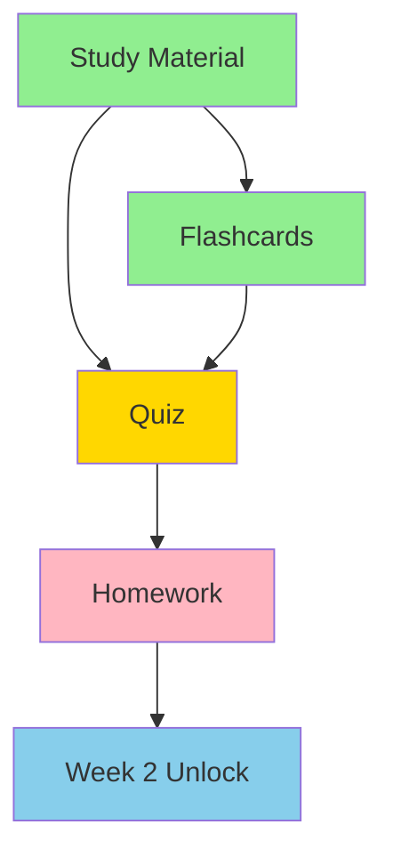

# Blocking Relationships

**Purpose:** Documentation for task dependencies and prerequisite relationships

**Last Updated:** 2025-11-06  
**OCDS Version:** 1.0.0

---

## 📋 Overview

Blocking relationships define **dependencies between materials** - which content must be completed before other content unlocks. While OCDS generally avoids hard blocks, strategic use of dependencies ensures proper learning progression.

---

## 🎯 Types of Relationships

### 1. Sequential (Linear)

**Description:** Must complete A before B

```yaml
# timeline.yaml
weeks:
  - week: 1
    materials:
      - id: study_week01
        blocking: []  # No prerequisites
      
      - id: quiz_week01
        blocking:
          - study_week01  # Must read study material first
      
      - id: hw_week01
        blocking:
          - quiz_week01  # Must pass quiz first
```

**Use case:** Foundational knowledge required

---

### 2. Parallel (Independent)

**Description:** Can complete A and B in any order

```yaml
# timeline.yaml
weeks:
  - week: 2
    materials:
      - id: study_week02_tongue
        blocking: []
      
      - id: study_week02_pulse
        blocking: []  # Independent of tongue material
      
      - id: quiz_week02
        blocking:
          - study_week02_tongue
          - study_week02_pulse  # Must complete BOTH
```

**Use case:** Multiple independent topics

---

### 3. Conditional (Branching)

**Description:** Different paths based on performance

```yaml
# timeline.yaml
weeks:
  - week: 3
    materials:
      - id: quiz_week03
        blocking: []
      
      - id: remedial_materials
        blocking:
          - quiz_week03
        unlock_condition:
          quiz_week03_score: < 70  # Only if failed
      
      - id: advanced_materials
        blocking:
          - quiz_week03
        unlock_condition:
          quiz_week03_score: >= 90  # Only if excelled
```

**Use case:** Adaptive learning paths

---

## 🔧 Dependency Configuration

### Material-Level Blocking

```yaml
---
ocds_type: quiz
material_id: quiz_week01
class_id: TCM_101
week: 1

# Blocking relationships
blocking:
  - material_id: study_week01
    status: completed  # Must be completed
  
  - material_id: flashcards_week01
    min_reviews: 10  # Must review 10 cards

# Unlock conditions
unlock_conditions:
  all_of:  # AND logic
    - study_week01: completed
    - flashcards_week01: min_reviews >= 10
---
```

---

### Week-Level Blocking

```yaml
# timeline.yaml
weeks:
  - week: 2
    unlock_requirements:
      - material_id: quiz_week01
        min_score: 70
      - material_id: hw_week01
        status: submitted
    
    # All Week 2 materials blocked until requirements met
```

---

## 📊 Dependency Types

### Hard Block (Required)

**Description:** Cannot proceed without completing prerequisite

```python
def check_hard_block(material_id: str, student_id: str) -> bool:
    """Check if material is hard-blocked."""
    
    material = load_material(material_id)
    blocking = material.get('blocking', [])
    
    for prereq in blocking:
        prereq_material = load_material(prereq['material_id'])
        
        # Check if prerequisite completed
        if prereq_material.get('status') != 'completed':
            return True  # Blocked!
    
    return False  # Not blocked
```

**Use sparingly!** Hard blocks can frustrate students.

---

### Soft Block (Recommended)

**Description:** Warning shown, but can proceed

```python
def check_soft_block(material_id: str, student_id: str) -> Dict[str, Any]:
    """Check if material has soft block warning."""
    
    material = load_material(material_id)
    recommended_prereqs = material.get('recommended_prereqs', [])
    
    warnings = []
    
    for prereq in recommended_prereqs:
        prereq_material = load_material(prereq['material_id'])
        
        if prereq_material.get('status') != 'completed':
            warnings.append({
                'type': 'recommended_prereq',
                'material': prereq['material_id'],
                'message': f"We recommend completing {prereq['title']} first"
            })
    
    return {
        'blocked': False,
        'warnings': warnings
    }
```

**Better approach!** Guides without blocking.

---

## 🔄 Dependency Resolution

### Checking Dependencies

```python
def can_access_material(material_id: str, student_id: str) -> Dict[str, Any]:
    """Check if student can access material."""
    
    material = load_material(material_id)
    
    # Check if unlocked
    if not material.get('unlocked', False):
        return {
            'accessible': False,
            'reason': 'not_unlocked',
            'message': 'This material is not yet unlocked'
        }
    
    # Check hard blocks
    blocking = material.get('blocking', [])
    
    for prereq in blocking:
        if not is_prerequisite_met(student_id, prereq):
            return {
                'accessible': False,
                'reason': 'prerequisite_not_met',
                'prerequisite': prereq,
                'message': f"Please complete {prereq['title']} first"
            }
    
    # Check soft blocks (warnings only)
    warnings = check_soft_blocks(material_id, student_id)
    
    return {
        'accessible': True,
        'warnings': warnings
    }


def is_prerequisite_met(student_id: str, prereq: Dict[str, Any]) -> bool:
    """Check if a prerequisite is met."""
    
    material = load_material(prereq['material_id'])
    
    # Check completion status
    if 'status' in prereq:
        if material.get('status') != prereq['status']:
            return False
    
    # Check minimum score
    if 'min_score' in prereq:
        if material.get('score', 0) < prereq['min_score']:
            return False
    
    # Check minimum reviews
    if 'min_reviews' in prereq:
        if material.get('reviews_completed', 0) < prereq['min_reviews']:
            return False
    
    return True
```

---

## 📈 Dependency Visualization

### Dependency Graph



### Student Progress View

```dataview
TABLE
  material_title as "Material",
  status as "Status",
  blocking_status as "Blocked By",
  can_access as "Accessible"
FROM "Classes/TCM_101/Materials/Week_01"
WHERE student_id = "john_doe"
```

---

## 🎯 Best Practices

### For Instructors

**Designing Dependencies:**
- ✅ **Use sparingly** - Too many blocks frustrate students
- ✅ **Prefer soft blocks** - Warn, don't prevent
- ✅ **Logical progression** - Dependencies should make sense
- ✅ **Test the flow** - Walk through student experience
- ✅ **Provide alternatives** - Multiple paths when possible

**Common Patterns:**
```
Good:
Study Material → Quiz → Homework
(Logical progression)

Bad:
Flashcards → Quiz → Study Material
(Backwards!)

Better:
Study Material (recommended) → Quiz
(Soft block, not hard)
```

---

### For Students

**Understanding Dependencies:**
- ✅ **Check prerequisites** - See what's required
- ✅ **Follow recommendations** - Soft blocks are there for a reason
- ✅ **Complete in order** - Don't skip ahead
- ✅ **Ask if stuck** - Instructor can override blocks

---

## 🔍 Troubleshooting

### Common Issues

**Issue:** "Material won't unlock even though I completed prerequisite"  
**Solution:** Check that prerequisite status is "completed" in frontmatter. Run `unlock_manager.py` manually.

**Issue:** "I want to skip ahead but material is blocked"  
**Solution:** Contact instructor for override. Explain your reasoning.

**Issue:** "Dependency graph is confusing"  
**Solution:** View dependency visualization in dashboard. Check material frontmatter for blocking list.

---

## 📚 Related Documentation

- [[Progression_Logic.md]] - Unlock logic
- [[Flexible_Pacing.md]] - Pacing strategies
- [[Timeline_Schema.md]] - Timeline configuration
- [[unlock_manager.py.md]] - Unlock script

---

*Last updated: 2025-11-06*  
*OCDS Version: 1.0.0*
