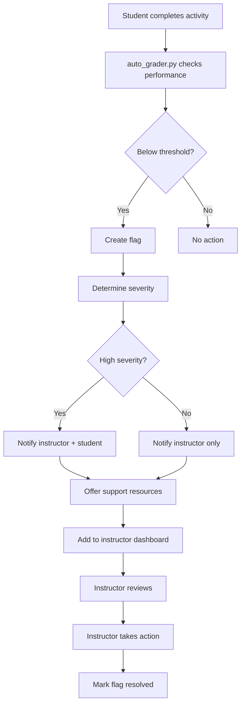

# Review Flags

**Purpose:** System for identifying and supporting struggling students

**Last Updated:** 2025-11-06  
**OCDS Version:** 1.0.0

---

## 📋 Overview

Review flags are OCDS's approach to supporting struggling students **without blocking their progress**. Instead of preventing students from advancing, the system flags them for instructor review and offers targeted support.

---

## 🎯 Philosophy: Support, Don't Block

### Traditional Approach (Blocking)

```
Student scores 55% on quiz
→ Next week stays locked
→ Student stuck, frustrated
→ May give up entirely
```

### OCDS Approach (Flagging)

```
Student scores 55% on quiz
→ Next week unlocks on schedule
→ Student flagged for review
→ Instructor notified
→ Support resources offered
→ Student continues learning
```

**Why this works:**
- ✅ Maintains student momentum
- ✅ Reduces frustration and dropout
- ✅ Allows instructor intervention
- ✅ Provides targeted support
- ✅ Respects student autonomy

---

## 🚩 Flag Types

### 1. Performance Flags

**Low Quiz Score:**
```python
if quiz_score < 60:
    create_flag(
        student_id=student_id,
        type='low_quiz_score',
        severity='high',
        week=week,
        details={'score': quiz_score, 'threshold': 60}
    )
```

**Low Homework Score:**
```python
if homework_score < 70:
    create_flag(
        student_id=student_id,
        type='low_homework_score',
        severity='medium',
        week=week,
        details={'score': homework_score}
    )
```

---

### 2. Engagement Flags

**Low Task Completion:**
```python
if task_completion < 50:
    create_flag(
        student_id=student_id,
        type='low_engagement',
        severity='medium',
        week=week,
        details={'completion': task_completion}
    )
```

**No Activity:**
```python
days_since_activity = (datetime.now() - last_activity_date).days

if days_since_activity > 7:
    create_flag(
        student_id=student_id,
        type='inactive',
        severity='high',
        week=week,
        details={'days_inactive': days_since_activity}
    )
```

---

### 3. Trend Flags

**Declining Performance:**
```python
recent_scores = get_recent_scores(student_id, weeks=3)

if is_declining_trend(recent_scores):
    create_flag(
        student_id=student_id,
        type='declining_performance',
        severity='medium',
        details={'scores': recent_scores}
    )
```

**Consistent Low Performance:**
```python
recent_scores = get_recent_scores(student_id, weeks=3)

if all(score < 70 for score in recent_scores):
    create_flag(
        student_id=student_id,
        type='consistent_low_performance',
        severity='high',
        details={'avg_score': sum(recent_scores) / len(recent_scores)}
    )
```

---

## 🔧 Flag Configuration

### grading_config.yaml

```yaml
# Review Flag Settings
review_flags:
  enabled: true
  
  # Performance thresholds
  thresholds:
    quiz_low: 60
    quiz_critical: 50
    homework_low: 70
    task_completion_low: 50
    inactive_days: 7
  
  # Flag severity levels
  severity_levels:
    high:
      notify_instructor: true
      notify_student: true
      offer_support: true
    medium:
      notify_instructor: true
      notify_student: false
      offer_support: true
    low:
      notify_instructor: false
      notify_student: false
      offer_support: false
  
  # Auto-actions
  auto_actions:
    high_severity:
      - send_support_email
      - schedule_check_in
      - unlock_review_materials
    medium_severity:
      - send_support_email
      - unlock_review_materials
```

---

## 📊 Flag Data Structure

### Flag Schema

```yaml
# student_flags.yaml
flags:
  - flag_id: flag_001
    student_id: john_doe
    class_id: TCM_101
    week: 2
    type: low_quiz_score
    severity: high
    created_date: 2025-01-10
    
    details:
      score: 55
      threshold: 60
      quiz_id: quiz_week02
    
    status: open  # open, acknowledged, resolved
    
    actions_taken:
      - action: support_email_sent
        date: 2025-01-10
      - action: review_materials_unlocked
        date: 2025-01-10
    
    instructor_notes: "Scheduled office hours meeting for 2025-01-12"
    
    resolved_date: null
    resolution: null
```

---

## 🔄 Flag Workflow



---

## 📧 Automated Support

### Support Email Template

```markdown
Subject: Week 2 Review Resources - TCM 101

Hi John,

I noticed you scored 55% on the Week 2 quiz. Don't worry - this is a challenging topic and you're not alone!

Here are some resources to help:

**Review Materials:**
- [[Week 2 Study Material - Pulse Diagnosis]] (re-read)
- [[Week 2 Flashcards]] (extra practice)
- [[Week 2 Lecture Slides]] (visual review)

**Additional Support:**
- Office hours: Tuesdays 2-4pm
- Study group: Wednesdays 6pm
- Tutoring: Available upon request

**Next Steps:**
1. Review the materials above
2. Retake the quiz (you have 2 more attempts)
3. Reach out if you need help!

You can do this! 💪

Best,
Dr. Smith
```

---

## 📊 Instructor Dashboard

### Review Queue

```dataview
TABLE
  student_id as "Student",
  type as "Issue",
  severity as "Severity",
  week as "Week",
  created_date as "Flagged",
  status as "Status"
FROM "Classes/TCM_101/Flags"
WHERE status = "open"
SORT severity DESC, created_date ASC
```

### Flag Statistics

```dataviewjs
const flags = dv.pages('"Classes/TCM_101/Flags"');

const high = flags.filter(f => f.severity === 'high').length;
const medium = flags.filter(f => f.severity === 'medium').length;
const low = flags.filter(f => f.severity === 'low').length;

const open = flags.filter(f => f.status === 'open').length;
const resolved = flags.filter(f => f.status === 'resolved').length;

dv.paragraph(`
**Flag Statistics:**
- 🔴 High Severity: ${high}
- 🟡 Medium Severity: ${medium}
- 🟢 Low Severity: ${low}

**Status:**
- Open: ${open}
- Resolved: ${resolved}
`);
```

---

## 🎯 Instructor Actions

### Responding to Flags

**1. Acknowledge Flag**
```yaml
- action: acknowledged
  date: 2025-01-10
  instructor: dr_smith
```

**2. Contact Student**
```yaml
- action: email_sent
  date: 2025-01-10
  subject: "Week 2 Support Resources"
```

**3. Schedule Meeting**
```yaml
- action: meeting_scheduled
  date: 2025-01-12
  time: "14:00"
  type: office_hours
```

**4. Provide Resources**
```yaml
- action: resources_provided
  date: 2025-01-10
  resources:
    - review_materials
    - practice_quizzes
    - study_guide
```

**5. Resolve Flag**
```yaml
status: resolved
resolved_date: 2025-01-15
resolution: "Student retook quiz, scored 85%. Met in office hours."
```

---

## 🎯 Best Practices

### For Instructors

**Monitoring Flags:**
- ✅ **Check daily** - Review dashboard regularly
- ✅ **Prioritize high severity** - Address urgent issues first
- ✅ **Act quickly** - Respond within 24-48 hours
- ✅ **Document actions** - Record what you did
- ✅ **Follow up** - Check if support helped

**Supporting Students:**
- ✅ **Be proactive** - Reach out before they ask
- ✅ **Be encouraging** - Positive, supportive tone
- ✅ **Offer options** - Multiple support pathways
- ✅ **Personalize** - Tailor support to student needs
- ✅ **Track progress** - Monitor improvement

---

### For Students

**If You're Flagged:**
- ✅ **Don't panic** - Flags are for support, not punishment
- ✅ **Use resources** - Take advantage of offered help
- ✅ **Reach out** - Ask questions, attend office hours
- ✅ **Review materials** - Go back and study
- ✅ **Retake assessments** - Use retake opportunities

---

## 📚 Related Documentation

- [[Progression_Logic.md]] - Unlock logic
- [[Flexible_Pacing.md]] - Pacing strategies
- [[Auto_Grading_Overview.md]] - Grading system
- [[unlock_manager.py.md]] - Unlock script

---

*Last updated: 2025-11-06*  
*OCDS Version: 1.0.0*
