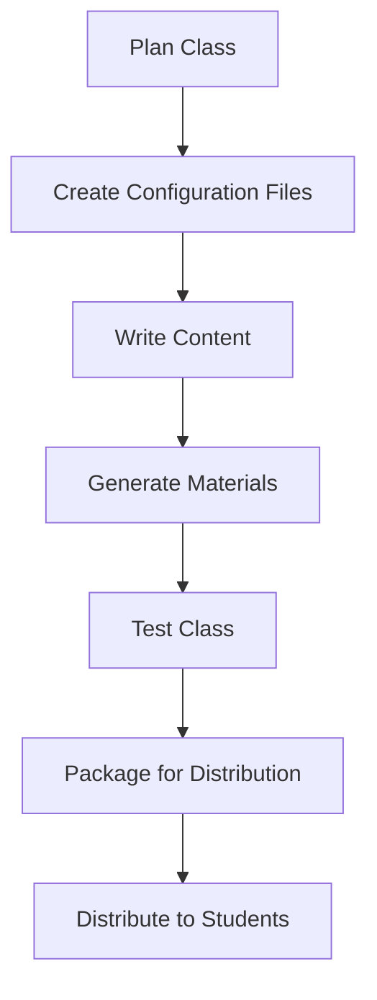

# Class Builder Guide

**Purpose:** Complete step-by-step guide to building an OCDS class

**Last Updated:** 2025-11-06  
**OCDS Version:** 1.0.0

---

## 📋 Overview

This guide walks you through the entire process of creating an OCDS class from scratch, from initial planning to final distribution.

---

## 🎯 Class Creation Workflow



---

## 📝 Step 1: Planning

### Define Learning Objectives

**Questions to answer:**
- What should students know by the end?
- What skills should they develop?
- How will you assess learning?
- What's the expected time commitment?

**Example:**
```
Class: Traditional Chinese Medicine Fundamentals (TCM 101)

Learning Objectives:
1. Identify tongue and pulse diagnostic patterns
2. Differentiate between major TCM patterns
3. Select appropriate treatment principles
4. Apply TCM theory to clinical cases

Duration: 12 weeks
Time commitment: 8-10 hours/week
```

---

### Plan Course Structure

**Decide on:**
- Number of weeks
- Topics per week
- Assessment types
- Grading weights

**Example Structure:**
```
Week 1: Introduction to Tongue Diagnosis
Week 2: Pulse Diagnosis Fundamentals
Week 3: Eight Principles Pattern Differentiation
Week 4: Qi, Blood, and Fluid Patterns
...
Week 12: Final Integration and Review
```

---

## 🔧 Step 2: Create Configuration Files

### 2.1 Create class_manifest.yaml

```yaml
# class_manifest.yaml
class_id: TCM_101
title: "Traditional Chinese Medicine Fundamentals"
subtitle: "Diagnosis and Pattern Differentiation"
version: "1.0.0"
author: "Dr. Jane Smith"
institution: "Acupuncture College"

description: |
  Comprehensive introduction to TCM diagnosis including tongue,
  pulse, and pattern differentiation.

duration_weeks: 12
estimated_hours_per_week: 8-10

prerequisites:
  - "Basic anatomy and physiology"
  - "Introduction to TCM concepts"

learning_objectives:
  - "Master tongue and pulse diagnosis"
  - "Differentiate major TCM patterns"
  - "Apply treatment principles"

tags:
  - tcm
  - diagnosis
  - fundamentals
  - beginner
```

---

### 2.2 Create grading_config.yaml

```yaml
# grading_config.yaml
weights:
  quizzes: 0.40
  flashcards: 0.30
  homework: 0.20
  tasks: 0.10

quiz_grading:
  passing_score: 70
  allow_retakes: true
  max_attempts: 3
  score_method: best

letter_grades:
  A: 93
  A-: 90
  B+: 87
  B: 83
  B-: 80
  C+: 77
  C: 73
  C-: 70
  D: 60
  F: 0
```

---

### 2.3 Create timeline.yaml

```yaml
# timeline.yaml
class_id: TCM_101
pacing_strategy: hybrid

weeks:
  - week: 1
    title: "Introduction to Tongue Diagnosis"
    unlock_date: 2025-01-01
    due_date: 2025-01-07
    
    topics:
      - "Tongue body characteristics"
      - "Tongue coating analysis"
      - "Pattern identification from tongue"
    
    materials:
      - type: study
        title: "Tongue Diagnosis Fundamentals"
        estimated_time: 60
      
      - type: flashcards
        title: "Tongue Diagnosis Terms"
        card_count: 20
      
      - type: quiz
        title: "Week 1 Quiz"
        questions: 10
        points: 10
      
      - type: homework
        title: "Tongue Case Study Analysis"
        points: 20
```

---

### 2.4 Create question_bank.yaml

```yaml
# question_bank.yaml
questions:
  - id: q_week01_001
    week: 1
    type: multiple_choice
    difficulty: easy
    text: "Which tongue color indicates Heat?"
    options:
      - id: A
        text: "Pale"
      - id: B
        text: "Red"
      - id: C
        text: "Purple"
      - id: D
        text: "Blue"
    correct_answer: B
    explanation: "Red tongue indicates Heat in TCM diagnosis."
    points: 1
    tags: [tongue, heat, diagnosis]
```

---

## 📚 Step 3: Write Content

### 3.1 Study Materials

Create markdown files with your teaching content:

```markdown
---
ocds_type: study
material_id: study_week01_tongue
week: 1
title: "Introduction to Tongue Diagnosis"
---

# Introduction to Tongue Diagnosis

## Learning Objectives

By the end of this lesson, you will:
- Identify normal tongue characteristics
- Recognize pathological tongue signs
- Correlate tongue findings with TCM patterns

## Tongue Body Characteristics

### Color

The tongue body color reflects the state of Qi, Blood, and organs...

[Continue with detailed content]
```

---

### 3.2 Homework Assignments

```markdown
---
ocds_type: homework
material_id: hw_week01_tongue_cases
week: 1
title: "Tongue Case Study Analysis"
points_possible: 20
---

# Week 1 Homework: Tongue Case Study

Analyze the following three tongue images...

[Assignment details]
```

---

## 🤖 Step 4: Generate Materials

### Run Material Generator

```bash
# Generate all materials from timeline
python generate_materials.py --class-id TCM_101 --weeks 1-12

# Generate task lists
python generate_tasks.py --class-id TCM_101 --weeks 1-12
```

**Output:**
```
Classes/TCM_101/
├── Materials/
│   ├── Week_01/
│   │   ├── Study_Material.md
│   │   ├── Flashcards.md
│   │   ├── Quiz.md
│   │   ├── Homework.md
│   │   ├── Slides.md
│   │   └── Tasks.md
│   ├── Week_02/
│   └── ...
```

---

## 🧪 Step 5: Test Class

### Import and Test

```bash
# Import class as test student
python import_class.py \
  --package TCM_101.zip \
  --student-id test_student \
  --vault-path test_vault/
```

### Test Checklist

- [ ] All materials unlock correctly
- [ ] Quizzes grade properly
- [ ] Homework submissions work
- [ ] Flashcards integrate with SR plugin
- [ ] Tasks track completion
- [ ] Dashboard displays correctly
- [ ] Grading calculates accurately
- [ ] Unlock logic works as expected

---

## 📦 Step 6: Package Class

```bash
python package_class.py \
  --class-id TCM_101 \
  --output TCM_101_v1.0.0.zip
```

**Package Contents:**
```
TCM_101_v1.0.0.zip
├── class_manifest.yaml
├── timeline.yaml
├── grading_config.yaml
├── question_bank.yaml
├── Materials/
├── Images/
├── Resources/
└── README.md
```
> The class builder is something I want to get usable. I mean it has to be kind of intuitive so anyone can  use it. I want people to want to use it to make a class. It should be functional. I also want to look into linking up with the research bot to format it's research into a way that can be automatically parsed by a script that will generate a bank, cards, slides, maybe even a guided discussion, homework, or more unique formats. but the consistently structured stuff should be doable like flashcards always have the same syntax so it's repeatable. could turn it into an app that generates material based on a deep research. then you can charge by the topic and it's basically a deep research that gets material generated. so you put in a topic. the research bot does a deep research and maybe some websearch/youtube search etc. puts together a comprehensive note in a standard format. the scripts then parse the comprehensive note to generate cards, bank, slides, and the information is put into your vault in the app. so each topic could be like $1 worth of a token and then you can even have a guided AI discussion with an AI voice chat based on the deep research. the AI guided research is basically a prompt or series of prompts that asks a question or introduces a topic and does not trigger the next prompt until the user inputs a response that satisfies the trigger. like if the first trigger is what's your name? the AI guided discussion won't advance to the next prompt until the user says their name. so the guided AI discussion could ask you a question and if you say you don't know then it can explain it to you and ask you to explain it back. then give you a critique or pass you on to the next prompt in the guided discussion
---

## 🚀 Step 7: Distribute

### Distribution Options

1. **Direct Distribution** - Email .zip to students
2. **File Sharing** - Google Drive, Dropbox
3. **LMS Integration** - Upload to learning platform
4. **Marketplace** - List on OCDS marketplace (future)

---

## 📚 Related Documentation

- [[Material_Selection.md]] - Choosing content
- [[Timeline_Design.md]] - Scheduling
- [[Question_Bank_Creation.md]] - Writing quizzes
- [[Testing_Classes.md]] - QA process

---

*Last updated: 2025-11-06*  
*OCDS Version: 1.0.0*
