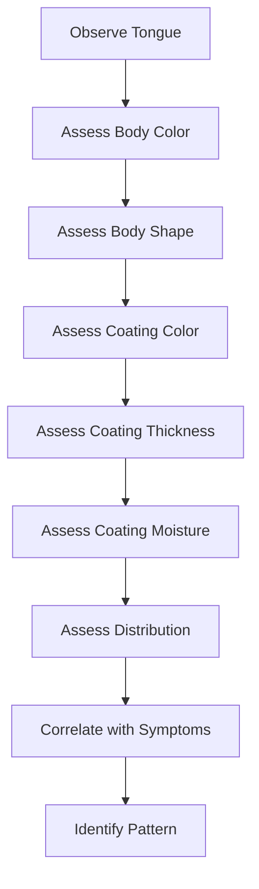
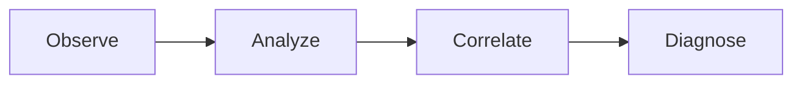

# Slide Deck Template

**Purpose:** Define the structure and format for presentation slides using Advanced Slides plugin in OCDS classes

**Last Updated:** 2025-11-06  
**OCDS Version:** 1.0.0

---

## 📋 Overview

Slide decks in OCDS use the **Advanced Slides** plugin to create beautiful, interactive presentations directly in Obsidian markdown. These slides can be used for:

- **Lectures** - Instructor-led presentations
- **Student presentations** - Project presentations, case studies
- **Review sessions** - Visual summaries of key concepts
- **Self-study** - Students can review slides at their own pace

### Key Features

- ✅ **Markdown-based** - Easy to create and edit
- ✅ **Reveal.js powered** - Professional presentation engine
- ✅ **Interactive elements** - Embedded quizzes, videos, diagrams
- ✅ **Themes** - Customizable appearance
- ✅ **Export options** - PDF, HTML, or present live
- ✅ **Speaker notes** - Hidden notes for presenters

---

## 🎯 When to Use Slide Decks

| Use Slide Decks For... | Use Study Materials For... |
|------------------------|----------------------------|
| Visual presentations | Detailed reading |
| Lectures and talks | Reference documentation |
| Quick reviews | In-depth explanations |
| Diagrams and images | Text-heavy content |
| Live presentations | Self-paced study |

**Example Slide Deck Topics:**
- Lecture: Introduction to Tongue Diagnosis
- Review: Week 1 Key Concepts
- Student presentation: Case study analysis
- Visual guide: Acupuncture point locations

---

## 📝 Slide Deck File Structure

### Frontmatter Schema

```yaml
---
# === OCDS CORE METADATA ===
ocds_type: slides
material_id: slides_week01_tongue_diagnosis
class_id: TCM_101
week: 1
day: 2

# === SLIDE DETAILS ===
title: "Introduction to Tongue Diagnosis"
description: "Visual guide to tongue body and coating analysis"
author: "Dr. Jane Smith"
date: 2025-01-08

# === ADVANCED SLIDES CONFIG ===
theme: black  # black, white, league, beige, sky, night, serif, simple, solarized
transition: slide  # none, fade, slide, convex, concave, zoom
controls: true
progress: true
slideNumber: true
history: true
keyboard: true
overview: true
center: true
touch: true
loop: false
rtl: false
shuffle: false
fragments: true
embedded: false
help: true
showNotes: false
autoSlide: 0  # 0 = disabled, or milliseconds
autoSlideStoppable: true
mouseWheel: false
hideAddressBar: true
previewLinks: false
width: 960
height: 700
margin: 0.04
minScale: 0.2
maxScale: 2.0

# === TIMELINE ===
unlock_requirements:
  - material_id: study_week01_tongue
    status: completed

# === TRACKING ===
view_status: not_viewed  # not_viewed, in_progress, completed
first_viewed: null
last_viewed: null
view_count: 0
slides_viewed: []  # Track which slides viewed
time_spent: 0  # Minutes

# === TAGS ===
tags:
  - slides
  - week1
  - tongue_diagnosis
  - lecture
---
```

---

## 🏗️ Slide Deck Content Structure

### Basic Slide Syntax

```markdown
---
theme: black
---

# Title Slide
## Subtitle

---

## Slide with Content

- Bullet point 1
- Bullet point 2
- Bullet point 3

---

## Slide with Image


---

## Slide with Two Columns

<!-- slide-column: 0.5 -->
Left column content

<!-- slide-column: 0.5 -->
Right column content

---

## Slide with Speaker Notes

This is visible content

Note: These are speaker notes, only visible in presenter mode
```

---

### Advanced Slides Features

#### Fragments (Incremental Reveal)

```markdown
## Incremental Content

- First point <!-- .element: class="fragment" -->
- Second point <!-- .element: class="fragment" -->
- Third point <!-- .element: class="fragment" -->
```

#### Vertical Slides

```markdown
## Main Topic

---

### Subtopic 1

<!-- slide-column: vertical -->

---

### Subtopic 2

<!-- slide-column: vertical -->
```

#### Background Images

```markdown
<!-- slide bg="path/to/image.jpg" -->

## Slide with Background Image
```

#### Custom Styling

```markdown
<!-- .slide: data-background-color="#ff0000" -->

## Red Background Slide
```
> I really want to get the slides looking good. it would be so cool to have some automaticlaly generated slides with pics, colors, animations, speaker notes. 
---

## 📖 Complete Example: Tongue Diagnosis Lecture

### Example File: `Slides_Week01_Tongue_Diagnosis.md`

```markdown
---
ocds_type: slides
material_id: slides_week01_tongue_diagnosis
class_id: TCM_101
week: 1
day: 2

title: "Introduction to Tongue Diagnosis"
description: "Visual guide to tongue body and coating analysis"
author: "Dr. Jane Smith"
date: 2025-01-08

theme: black
transition: slide
controls: true
progress: true
slideNumber: true
center: true

tags:
  - slides
  - week1
  - tongue_diagnosis
---

<!-- slide bg="images/tcm_background.jpg" -->

# Introduction to Tongue Diagnosis

**TCM 101 - Week 1**

Dr. Jane Smith  
January 8, 2025

---

## Learning Objectives

By the end of this lecture, you will be able to:

1. Identify the major areas of the tongue <!-- .element: class="fragment" -->
2. Describe tongue body characteristics <!-- .element: class="fragment" -->
3. Analyze tongue coating features <!-- .element: class="fragment" -->
4. Correlate tongue findings with TCM patterns <!-- .element: class="fragment" -->

Note: Emphasize that tongue diagnosis is ONE tool among many. Never diagnose from tongue alone.

---

## Why Tongue Diagnosis?

<!-- slide-column: 0.5 -->

### Advantages

- ✅ Non-invasive
- ✅ Immediate information
- ✅ Reflects internal conditions
- ✅ Changes over time

<!-- slide-column: 0.5 -->

### Limitations

- ❌ Can be influenced by food/drink
- ❌ Requires good lighting
- ❌ Must consider full picture
- ❌ Individual variations

Note: Always ask patient about recent food/drink, medications, smoking

---

<!-- slide bg="#1a1a2e" -->

# Part 1: Tongue Anatomy

---

## Tongue Areas and Organ Correspondence


- **Tip:** Heart, Lungs
- **Center:** Spleen, Stomach
- **Root:** Kidneys, Bladder
- **Sides:** Liver, Gallbladder

Note: This is the traditional mapping. Some practitioners use different systems.

---

## Normal Tongue Characteristics

<!-- slide-column: 0.6 -->


<!-- slide-column: 0.4 -->

### Features

- **Color:** Pale red
- **Shape:** Not too thick/thin
- **Coating:** Thin, white
- **Moisture:** Slightly moist
- **Movement:** Flexible

Note: Show multiple examples of "normal" - there's variation!

---

<!-- slide bg="#1a1a2e" -->

# Part 2: Tongue Body

---

## Tongue Body Color

### Pale Tongue


**Indicates:** Qi/Blood/Yang Deficiency <!-- .element: class="fragment" -->

**Common patterns:** Spleen Qi Deficiency, Blood Deficiency <!-- .element: class="fragment" -->

Note: Pale = lack of warmth, energy, or blood nourishment

---

## Tongue Body Color

### Red Tongue


**Indicates:** Heat <!-- .element: class="fragment" -->

**Common patterns:** Yin Deficiency, Excess Heat <!-- .element: class="fragment" -->

Note: Distinguish between excess heat (bright red) and deficiency heat (darker red)

---

## Tongue Body Color

### Purple/Blue Tongue


**Indicates:** Blood Stasis, Cold <!-- .element: class="fragment" -->

**Common patterns:** Blood Stasis, Cold Obstruction <!-- .element: class="fragment" -->

Note: Purple-blue = cold stasis, Purple-red = heat with stasis

---

## Tongue Body Shape

| Shape | Indicates | Example Pattern |
|-------|-----------|-----------------|
| **Thin** | Deficiency | Blood/Yin Deficiency |
| **Swollen** | Dampness, Qi Deficiency | Spleen Qi Deficiency |
| **Stiff** | Internal Wind, Heat | Liver Wind |
| **Deviated** | Wind-Stroke | Post-stroke |
| **Cracked** | Yin Deficiency, Heat | Stomach Yin Deficiency |

Note: Shape changes develop slowly - indicates chronic conditions

---

## Tongue Body Shape Examples

<!-- slide-column: 0.33 -->

### Thin Tongue


Blood/Yin Deficiency

<!-- slide-column: 0.33 -->

### Swollen Tongue


Dampness, Qi Deficiency

<!-- slide-column: 0.33 -->

### Cracked Tongue


Yin Deficiency

---

<!-- slide bg="#1a1a2e" -->

# Part 3: Tongue Coating

---

## What is Tongue Coating?

<!-- slide-column: 0.5 -->


<!-- slide-column: 0.5 -->

### Coating Reflects:

- **Stomach Qi** (normal thin white)
- **Pathogenic factors** (thick, colored)
- **Progression of disease** (changes over time)

**Key principle:** Coating = condition of Stomach/Spleen and presence of pathogens

Note: Coating can change quickly - reflects acute conditions

---

## Coating Thickness

### Thin Coating (Normal)


- Can see tongue body through coating
- Indicates: Normal Stomach Qi

---

## Coating Thickness

### Thick Coating


- Cannot see tongue body
- Indicates: Pathogenic factor (Dampness, Phlegm, Food Stagnation)

Note: Thicker = more severe or deeper pathogen

---

## Coating Color

| Color | Indicates | Example Pattern |
|-------|-----------|-----------------|
| **White** | Cold, Exterior | Wind-Cold, Dampness |
| **Yellow** | Heat | Damp-Heat, Stomach Heat |
| **Gray** | Interior Heat/Cold | Chronic condition |
| **Black** | Extreme Heat/Cold | Severe, advanced disease |

Note: Color progression: white → yellow → gray → black (increasing severity)

---

## Coating Color Examples

<!-- slide-column: 0.5 -->

### White Coating


Cold pattern or exterior condition

<!-- slide-column: 0.5 -->

### Yellow Coating


Heat pattern (internal or excess)

---

## Coating Moisture

<!-- slide-column: 0.33 -->

### Normal Moisture


Slightly moist

<!-- slide-column: 0.33 -->

### Dry Coating


Yin Deficiency, Heat

<!-- slide-column: 0.33 -->

### Wet/Slippery


Dampness, Yang Deficiency

---

## Coating Distribution

### Peeled Coating


**Indicates:** Stomach/Kidney Yin Deficiency <!-- .element: class="fragment" -->

**Location matters:** Where coating is missing indicates which organ <!-- .element: class="fragment" -->

Note: Peeled coating = Yin deficiency in corresponding organ area

---

<!-- slide bg="#1a1a2e" -->

# Part 4: Clinical Application

---

## Putting It All Together

### Case Study: 45-year-old Female

**Complaints:** Fatigue, poor appetite, loose stools

**Tongue:** Pale, swollen with tooth marks, thin white coating

**Analysis:** <!-- .element: class="fragment" -->
- Pale body = Qi/Yang Deficiency <!-- .element: class="fragment" -->
- Swollen with tooth marks = Spleen Qi Deficiency <!-- .element: class="fragment" -->
- Thin white coating = No pathogenic factor <!-- .element: class="fragment" -->

**Pattern:** Spleen Qi Deficiency <!-- .element: class="fragment" -->

Note: Walk through the logic step by step. Emphasize correlation with symptoms.

---

## Common Tongue Patterns

| Tongue Presentation | Pattern | Key Features |
|---------------------|---------|--------------|
| Pale, swollen, tooth marks | Spleen Qi Deficiency | Fatigue, poor appetite |
| Red, no coating | Yin Deficiency | Night sweats, dry mouth |
| Red tip | Heart Fire | Insomnia, anxiety |
| Purple body | Blood Stasis | Fixed pain, dark complexion |
| Thick yellow coating | Damp-Heat | Heavy sensation, yellow discharge |

---

## Tongue Diagnosis Workflow



Note: Always follow systematic approach - don't jump to conclusions
> Got to get the slide template fine tuned. 
---

## Tips for Accurate Tongue Diagnosis

1. **Good lighting** - Natural light is best <!-- .element: class="fragment" -->
2. **Ask about food/drink** - Coffee, candy, medications <!-- .element: class="fragment" -->
3. **Observe quickly** - Tongue changes when extended <!-- .element: class="fragment" -->
4. **Consider context** - Age, season, constitution <!-- .element: class="fragment" -->
5. **Look at the whole picture** - Never diagnose from tongue alone <!-- .element: class="fragment" -->

Note: Tongue diagnosis is an art - takes practice!

---

## Common Mistakes to Avoid

- ❌ Diagnosing from tongue alone
- ❌ Ignoring recent food/drink
- ❌ Over-interpreting minor variations
- ❌ Forgetting to ask patient to relax tongue
- ❌ Not considering individual constitution

Note: Share stories of misdiagnosis from these mistakes

---

<!-- slide bg="#1a1a2e" -->

# Practice Time!

---

## Practice Case 1


**What do you see?**

Take 30 seconds to analyze this tongue...

Note: Give students time to think before revealing answer

---

## Practice Case 1 - Answer


- **Body:** Red, slightly dry
- **Coating:** Thin yellow, peeled in center
- **Pattern:** Stomach Yin Deficiency with Heat

Note: Explain each feature and how it leads to the pattern

---

## Practice Case 2


**What pattern does this suggest?**

---

## Practice Case 2 - Answer


- **Body:** Pale, swollen, tooth marks
- **Coating:** Thick white, greasy
- **Pattern:** Spleen Qi Deficiency with Dampness

---

<!-- slide bg="#1a1a2e" -->

# Summary & Next Steps

---

## Key Takeaways

1. Tongue diagnosis reflects internal organ conditions <!-- .element: class="fragment" -->
2. Assess BOTH body and coating systematically <!-- .element: class="fragment" -->
3. Correlate findings with patient symptoms <!-- .element: class="fragment" -->
4. Practice, practice, practice! <!-- .element: class="fragment" -->

Note: Emphasize that mastery comes with clinical experience

---

## Next Steps

### This Week:

- 📚 Read: Chapter 3 in textbook
- 🎴 Review: Tongue diagnosis flashcards
- ✍️ Complete: Tongue diagnosis homework
- 🔍 Practice: Analyze 10 tongue images

### Next Lecture:

**Pulse Diagnosis Fundamentals**

---

## Resources

### Required:
- [[Week 1 Study Material - Tongue Diagnosis]]
- [[Flashcards - Tongue Diagnosis]]
- [[Homework - Tongue Case Studies]]

### Optional:
- Maciocia, G. (2004). *Tongue Diagnosis in Chinese Medicine*
- [Online Tongue Atlas](https://example.com/tongue-atlas)

---

<!-- slide bg="images/tcm_background.jpg" -->

# Questions?

**Office Hours:** Tuesdays 2-4pm  
**Email:** dr.smith@tcm101.edu  
**Discussion Forum:** [[Week 1 Discussion]]

---

<!-- slide bg="#1a1a2e" -->

# Thank You!

**See you next week for Pulse Diagnosis!**

Note: Remind students about homework due date
```

---

## 🎨 Themes and Styling

### Available Themes

| Theme | Description | Best For |
|-------|-------------|----------|
| **black** | Dark background, white text | General lectures |
| **white** | Light background, dark text | Printing, bright rooms |
| **league** | Gray background, white text | Professional presentations |
| **beige** | Warm beige background | Comfortable viewing |
| **sky** | Blue gradient | Science topics |
| **night** | Dark blue background | Evening lectures |
| **serif** | Serif fonts | Traditional topics |
| **simple** | Minimal design | Clean, modern |
| **solarized** | Solarized color scheme | Developer-friendly |

---

### Custom CSS

Create `custom_slides.css` in your class folder:

```css
/* Custom slide styling */
.reveal h1 {
  color: #ff6b6b;
  font-family: 'Georgia', serif;
}

.reveal h2 {
  color: #4ecdc4;
}

.reveal .slides {
  text-align: left;
}

/* Highlight boxes */
.highlight {
  background-color: #ffe66d;
  padding: 10px;
  border-radius: 5px;
}

/* Custom fragment animations */
.reveal .fragment.grow {
  opacity: 1;
  visibility: inherit;
}

.reveal .fragment.grow.visible {
  transform: scale(1.2);
}
```

Reference in frontmatter:

```yaml
css: custom_slides.css
```

---

## 🔧 Advanced Features

### Embedded Videos

```markdown
## Video Example

<iframe width="560" height="315" 
  src="https://www.youtube.com/embed/VIDEO_ID" 
  frameborder="0" allowfullscreen>
</iframe>
```
> huh.. embedding a youtube video into the slides could be fun
---

### Interactive Quizzes

```markdown
## Quick Check

**Which tongue color indicates Heat?**

A) Pale <!-- .element: class="fragment" data-fragment-index="1" -->  
B) Red <!-- .element: class="fragment highlight-green" data-fragment-index="2" -->  
C) Purple <!-- .element: class="fragment" data-fragment-index="1" -->

<!-- .element: class="fragment" data-fragment-index="3" -->
**Answer: B - Red indicates Heat!**
```

---

### Mermaid Diagrams

```markdown
## Diagnostic Process


```

---

### Math Equations (MathJax)

```markdown
## Formula Dosage Calculation

$$
\text{Daily Dose} = \frac{\text{Herb Weight (g)} \times \text{Frequency}}{\text{Body Weight (kg)}}
$$
```

---

## 📊 Dataview Integration

### Show All Slides for This Week

```dataview
TABLE
  title as "Slide Deck",
  author as "Presenter",
  view_status as "Status",
  view_count as "Views"
FROM "Classes/TCM_101"
WHERE ocds_type = "slides" AND week = 1
SORT day ASC
```

---

### Track Slide Viewing Progress

```dataview
TABLE
  title as "Presentation",
  view_status as "Status",
  time_spent + " min" as "Time Spent",
  last_viewed as "Last Viewed"
FROM "Classes/TCM_101"
WHERE ocds_type = "slides" AND view_status != "not_viewed"
SORT last_viewed DESC
```

---

## 🔄 Automation Scripts

### Track Slide Views

```python
# scripts/track_slide_views.py

def update_slide_view_status(slide_file: str):
    """Update view tracking when slides are opened."""
    
    frontmatter = parse_frontmatter(slide_file)
    
    # Update view count
    view_count = frontmatter.get('view_count', 0) + 1
    
    # Update timestamps
    now = datetime.now().strftime('%Y-%m-%d')
    
    updates = {
        'view_count': view_count,
        'last_viewed': now,
        'view_status': 'in_progress'
    }
    
    # First view
    if frontmatter.get('first_viewed') is None:
        updates['first_viewed'] = now
    
    update_frontmatter(slide_file, updates)
```

---

### Export Slides to PDF

```python
# scripts/export_slides_pdf.py

import subprocess

def export_slides_to_pdf(slide_file: str, output_dir: str):
    """Export slide deck to PDF using decktape."""
    
    # Requires decktape: npm install -g decktape
    
    slide_url = f"file://{slide_file}"
    output_file = f"{output_dir}/{slide_file.stem}.pdf"
    
    subprocess.run([
        'decktape',
        'reveal',
        slide_url,
        output_file,
        '--size', '1920x1080'
    ])
    
    print(f"Exported: {output_file}")
```

---

## 🎯 Best Practices

### For Creating Slides

**Content:**
- ✅ **One idea per slide** - Don't overcrowd
- ✅ **Use visuals** - Images > text
- ✅ **Limit text** - 6 words per line, 6 lines per slide
- ✅ **High contrast** - Readable from distance
- ✅ **Consistent style** - Same fonts, colors throughout

**Structure:**
- ✅ **Clear title slide** - Topic, presenter, date
- ✅ **Learning objectives** - What students will learn
- ✅ **Logical flow** - Introduction → Content → Summary
- ✅ **Section dividers** - Break up long presentations
- ✅ **Summary slide** - Key takeaways

**Engagement:**
- ✅ **Use fragments** - Reveal content progressively
- ✅ **Include questions** - Check understanding
- ✅ **Add practice** - Apply concepts
- ✅ **Vary format** - Mix text, images, diagrams
- ✅ **Speaker notes** - Remind yourself what to say

---

### For Presenting Slides

**Preparation:**
- ✅ **Practice** - Rehearse timing and flow
- ✅ **Test technology** - Check display, controls
- ✅ **Prepare notes** - Use speaker notes feature
- ✅ **Have backup** - PDF export in case of issues

**Delivery:**
- ✅ **Face audience** - Don't read from screen
- ✅ **Pace yourself** - Not too fast or slow
- ✅ **Engage students** - Ask questions, check understanding
- ✅ **Use pointer** - Highlight key elements
- ✅ **Allow questions** - Pause for clarification

---

## 🔍 Troubleshooting

### Common Issues

**Issue:** "Slides don't render properly"  
**Solution:** Make sure Advanced Slides plugin is installed and enabled. Check frontmatter syntax.

**Issue:** "Images don't show"  
**Solution:** Use relative paths from vault root. Check image file exists. Use forward slashes `/` not backslashes.

**Issue:** "Theme doesn't apply"  
**Solution:** Check theme name spelling in frontmatter. Reload slide deck. Try different theme.

**Issue:** "Fragments don't work"  
**Solution:** Check fragment syntax: `<!-- .element: class="fragment" -->`. Make sure `fragments: true` in frontmatter.

**Issue:** "Can't export to PDF"  
**Solution:** Use Advanced Slides export feature or install decktape. Check file permissions.

**Issue:** "Presenter mode doesn't show notes"  
**Solution:** Press `S` key to open speaker view. Make sure notes are formatted correctly with `Note:` prefix.

---

## 📚 Related Documentation

- [[Advanced_Slides_Integration.md]] - Complete plugin guide
- [[Study_Material_Template.md]] - Text-based learning materials
- [[Meta_Bind_Syntax.md]] - Interactive elements
- [[Dataview_Queries.md]] - Dashboard queries

---

## 🎓 Slide Deck vs. Other Material Types

| Feature | Slide Decks | Study Materials | Videos |
|---------|-------------|-----------------|--------|
| **Format** | Visual, concise | Text, detailed | Recorded |
| **Best for** | Presentations | Reference | Demonstrations |
| **Interactivity** | Medium | Low | Low |
| **Creation time** | Medium | High | Very high |
| **Update ease** | Easy | Easy | Difficult |
| **Accessibility** | Good | Excellent | Medium |

---

## ✅ Slide Deck Checklist

### For Instructors Creating Slides

- [ ] Clear, descriptive title
- [ ] Complete frontmatter with all required fields
- [ ] Title slide with topic, presenter, date
- [ ] Learning objectives stated
- [ ] Logical content flow
- [ ] Section dividers for long presentations
- [ ] High-quality images (not pixelated)
- [ ] Consistent theme and styling
- [ ] Speaker notes for each slide
- [ ] Practice questions or examples
- [ ] Summary slide with key takeaways
- [ ] Resources and next steps
- [ ] Questions/contact slide
- [ ] Tested in presentation mode
- [ ] PDF export created (backup)

---

### For Students Viewing Slides

- [ ] Open in Advanced Slides presentation mode
- [ ] Review learning objectives first
- [ ] Take notes on key concepts
- [ ] Pause on complex slides
- [ ] Try practice questions
- [ ] Review summary slide
- [ ] Check linked resources
- [ ] Mark as viewed in frontmatter
- [ ] Follow up with study materials

---

## 🎬 Keyboard Shortcuts

| Key | Action |
|-----|--------|
| **Space / →** | Next slide |
| **← ** | Previous slide |
| **↑ / ↓** | Navigate vertical slides |
| **Home** | First slide |
| **End** | Last slide |
| **Esc / O** | Overview mode |
| **S** | Speaker notes mode |
| **F** | Fullscreen |
| **B / .** | Pause (black screen) |
| **?** | Show help |

---

**Slides are for showing, not telling. Make them visual!**

---

*Last updated: 2025-11-06*  
*OCDS Version: 1.0.0*
