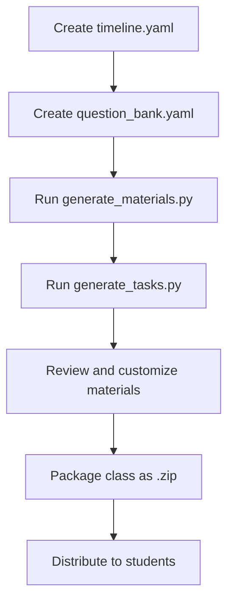
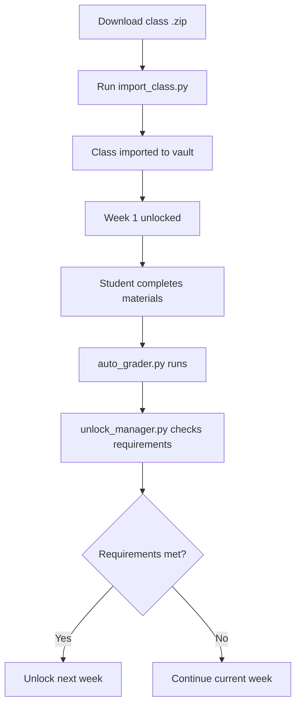
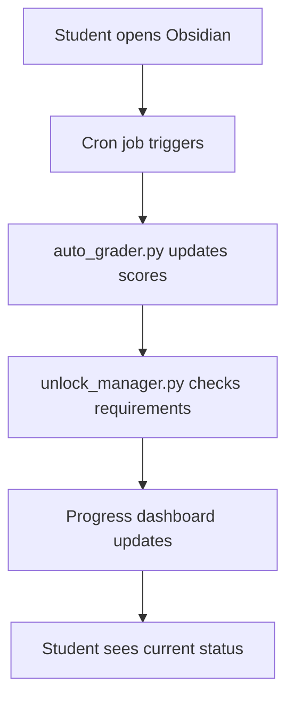

# Automation Scripts Overview

**Purpose:** Overview of all Python automation scripts that power the OCDS system

**Last Updated:** 2025-11-06  
**OCDS Version:** 1.0.0

---

## 📋 Overview

OCDS uses Python automation scripts to handle repetitive tasks and complex operations that would be tedious to do manually. These scripts transform OCDS from a collection of templates into a fully functional class delivery system.

### Why Automation?

**Without automation, instructors would need to:**
- ❌ Manually create every material file with correct frontmatter
- ❌ Hand-calculate grades from multiple sources
- ❌ Manually check unlock requirements for every student
- ❌ Update progress tracking by hand
- ❌ Generate task lists for each week manually

**With automation:**
- ✅ Import entire classes with one command
- ✅ Auto-generate materials from templates
- ✅ Auto-grade quizzes and calculate final scores
- ✅ Auto-unlock content based on performance
- ✅ Auto-update progress dashboards

---

## 🎯 Core Automation Scripts

### 1. **import_class.py** - Class Import Engine

**Purpose:** Import packaged classes into Obsidian vault

**What it does:**
- Extracts `.zip` class packages
- Creates folder structure
- Copies materials to correct locations
- Initializes student progress tracking
- Sets up dashboards

**When to use:**
- Student imports a new class
- Instructor tests a class package
- Updating an existing class

**Example:**
```bash
python import_class.py --package TCM_101.zip --student-id john_doe
```

📖 **Full Documentation:** [[import_class.py.md]]

---

### 2. **generate_materials.py** - Material Generation

**Purpose:** Generate course materials from templates and timeline

**What it does:**
- Reads `timeline.yaml` configuration
- Creates study materials from templates
- Generates quiz files with questions from question bank
- Creates homework assignments
- Builds slide decks
- Applies correct frontmatter to all files

**When to use:**
- Building a new class
- Adding new weeks to existing class
- Regenerating materials after template changes

**Example:**
```bash
python generate_materials.py --class-id TCM_101 --weeks 1-12
```

📖 **Full Documentation:** [[generate_materials.py.md]]

---

### 3. **generate_tasks.py** - Task List Generation

**Purpose:** Auto-generate task checklists from timeline

**What it does:**
- Reads timeline and materials
- Creates weekly task checklists
- Links tasks to materials
- Sets due dates and unlock requirements
- Calculates point values

**When to use:**
- After generating materials
- When timeline changes
- Adding new weeks

**Example:**
```bash
python generate_tasks.py --class-id TCM_101 --week 1
```

📖 **Full Documentation:** [[generate_tasks.py.md]]

---

### 4. **auto_grader.py** - Grading Engine

**Purpose:** Auto-grade quizzes and calculate final scores

**What it does:**
- Grades multiple choice quizzes
- Tracks flashcard completion
- Counts Pomodoro sessions
- Calculates weighted scores
- Updates progress tracking
- Generates grade reports

**When to use:**
- After student completes quiz
- Daily/weekly grade updates
- Generating final grade reports

**Example:**
```bash
python auto_grader.py --class-id TCM_101 --student-id john_doe
```

📖 **Full Documentation:** [[auto_grader.py.md]]

---

### 5. **unlock_manager.py** - Content Unlocking

**Purpose:** Manage content unlocking based on performance and timeline

**What it does:**
- Checks unlock requirements
- Evaluates student performance
- Unlocks content when requirements met
- Flags struggling students for review
- Handles early unlocking for high performers
- Respects timeline constraints

**When to use:**
- After quiz completion
- Daily unlock checks
- When student requests early unlock

**Example:**
```bash
python unlock_manager.py --class-id TCM_101 --student-id john_doe --check-all
```

📖 **Full Documentation:** [[unlock_manager.py.md]]

---

## 🔄 Automation Workflow

### Class Creation Workflow (Instructor)



**Commands:**
```bash
# 1. Generate all materials
python generate_materials.py --class-id TCM_101 --weeks 1-12

# 2. Generate task lists
python generate_tasks.py --class-id TCM_101 --weeks 1-12

# 3. Package for distribution
python package_class.py --class-id TCM_101 --output TCM_101.zip
```

---

### Class Import Workflow (Student)



**Commands:**
```bash
# 1. Import class
python import_class.py --package TCM_101.zip --student-id john_doe

# 2. Auto-grading runs automatically after quiz completion
# (or manually)
python auto_grader.py --class-id TCM_101 --student-id john_doe

# 3. Check unlock status
python unlock_manager.py --class-id TCM_101 --student-id john_doe --check-all
```

---

### Daily Automation Workflow



**Cron setup (optional):**
```bash
# Run grading and unlock checks daily at 6am
0 6 * * * python /path/to/auto_grader.py --all-students
0 6 * * * python /path/to/unlock_manager.py --all-students
```

---

## 🛠️ Script Dependencies

### Required Python Packages

```bash
pip install pyyaml          # YAML parsing
pip install python-frontmatter  # Frontmatter handling
pip install jinja2          # Template rendering
pip install click           # CLI interface
pip install rich            # Terminal formatting
pip install pathlib         # Path handling
```

**Install all at once:**
```bash
pip install -r requirements.txt
```

---

### File Dependencies

All scripts depend on these configuration files:

| File | Purpose | Required By |
|------|---------|-------------|
| `class_manifest.yaml` | Class metadata | All scripts |
| `timeline.yaml` | Week/day structure | generate_materials, generate_tasks |
| `grading_config.yaml` | Grading rules | auto_grader |
| `question_bank.yaml` | Quiz questions | generate_materials |
| `progress_tracking.yaml` | Student progress | auto_grader, unlock_manager |

---

## 📁 Script Locations

### Recommended Directory Structure

```
OCDS/
├── scripts/
│   ├── import_class.py
│   ├── generate_materials.py
│   ├── generate_tasks.py
│   ├── auto_grader.py
│   ├── unlock_manager.py
│   ├── package_class.py
│   └── utils/
│       ├── frontmatter_parser.py
│       ├── yaml_loader.py
│       ├── file_generator.py
│       └── grading_calculator.py
├── templates/
│   ├── study_material.md.j2
│   ├── quiz.md.j2
│   ├── homework.md.j2
│   ├── slides.md.j2
│   └── task.md.j2
├── requirements.txt
└── README.md
```

---

## 🎯 Common Use Cases

### Use Case 1: Build a New Class

```bash
# Step 1: Create configuration files
# - class_manifest.yaml
# - timeline.yaml
# - grading_config.yaml
# - question_bank.yaml

# Step 2: Generate materials
python generate_materials.py --class-id TCM_101 --weeks 1-12

# Step 3: Generate tasks
python generate_tasks.py --class-id TCM_101 --weeks 1-12

# Step 4: Review and customize
# Edit generated files as needed

# Step 5: Package for distribution
python package_class.py --class-id TCM_101 --output TCM_101.zip
```

---

### Use Case 2: Import a Class (Student)

```bash
# Step 1: Import class package
python import_class.py --package TCM_101.zip --student-id john_doe

# Step 2: Open Obsidian
# Week 1 is automatically unlocked

# Step 3: Complete materials
# Quizzes auto-grade when submitted

# Step 4: Check progress
python auto_grader.py --class-id TCM_101 --student-id john_doe --report
```

---

### Use Case 3: Update Grades and Unlock Content

```bash
# Manual grade update
python auto_grader.py --class-id TCM_101 --student-id john_doe

# Check unlock status
python unlock_manager.py --class-id TCM_101 --student-id john_doe --check-all

# Generate grade report
python auto_grader.py --class-id TCM_101 --student-id john_doe --report --output report.pdf
```

---

### Use Case 4: Add New Week to Existing Class

```bash
# Step 1: Update timeline.yaml (add week 13)

# Step 2: Add questions to question_bank.yaml

# Step 3: Generate new week materials
python generate_materials.py --class-id TCM_101 --weeks 13

# Step 4: Generate tasks for new week
python generate_tasks.py --class-id TCM_101 --week 13

# Step 5: Re-package class
python package_class.py --class-id TCM_101 --output TCM_101_v2.zip
```

---

## 🔧 Configuration

### Global Configuration File: `ocds_config.yaml`

```yaml
# OCDS Global Configuration

# Paths
vault_path: "/path/to/obsidian/vault"
classes_folder: "Classes"
materials_folder: "Materials"
templates_folder: "OCDS/templates"
scripts_folder: "OCDS/scripts"

# Defaults
default_grading_weights:
  quizzes: 0.40
  flashcards: 0.30
  homework: 0.20
  tasks: 0.10

default_unlock_requirements:
  min_quiz_score: 70
  min_flashcard_completion: 80
  min_task_completion: 80

# Automation
auto_grade_on_quiz_submit: true
auto_unlock_on_requirements_met: true
daily_progress_update: true
daily_update_time: "06:00"

# Notifications
notify_on_unlock: true
notify_on_grade_update: false
notify_on_review_flag: true

# Advanced
enable_early_unlock: true
early_unlock_threshold: 90  # 90% score allows early unlock
enable_late_submissions: true
late_penalty_per_day: 10  # 10% per day
max_late_days: 3
```

---

## 📊 Script Output Examples

### generate_materials.py Output

```
🎓 OCDS Material Generator
━━━━━━━━━━━━━━━━━━━━━━━━━━━━━━━━━━━━━━━━━━━━━━━

Class: TCM_101 - Traditional Chinese Medicine Fundamentals
Weeks: 1-12

📚 Generating Materials...

Week 1: Introduction to Tongue Diagnosis
  ✅ Study Material: Week_1_Study_Material.md
  ✅ Flashcards: Week_1_Flashcards.md (20 cards)
  ✅ Quiz: Week_1_Quiz.md (10 questions)
  ✅ Homework: Week_1_Homework.md
  ✅ Slides: Week_1_Slides.md (25 slides)

Week 2: Pulse Diagnosis Fundamentals
  ✅ Study Material: Week_2_Study_Material.md
  ✅ Flashcards: Week_2_Flashcards.md (25 cards)
  ✅ Quiz: Week_2_Quiz.md (10 questions)
  ✅ Homework: Week_2_Homework.md
  ✅ Slides: Week_2_Slides.md (30 slides)

[... weeks 3-12 ...]

━━━━━━━━━━━━━━━━━━━━━━━━━━━━━━━━━━━━━━━━━━━━━━━
✅ Complete!

Summary:
  📄 Files created: 60
  📝 Total lines: 45,000
  ⏱️  Time: 12.3 seconds

Next steps:
  1. Run: python generate_tasks.py --class-id TCM_101 --weeks 1-12
  2. Review generated materials in: Classes/TCM_101/
  3. Customize as needed
```

---

### auto_grader.py Output

```
📊 OCDS Auto-Grader
━━━━━━━━━━━━━━━━━━━━━━━━━━━━━━━━━━━━━━━━━━━━━━━

Class: TCM_101
Student: john_doe

📝 Grading Quizzes...
  Week 1 Quiz: 90% (9/10 correct)
  Week 2 Quiz: 85% (8.5/10 correct)
  Week 3 Quiz: 95% (9.5/10 correct)
  Average: 90%

🎴 Checking Flashcards...
  Week 1: 100% complete (20/20 cards, 85% accuracy)
  Week 2: 100% complete (25/25 cards, 90% accuracy)
  Week 3: 80% complete (20/25 cards, 88% accuracy)
  Average: 93%

✍️ Checking Homework...
  Week 1: 18/20 points (90%)
  Week 2: 19/20 points (95%)
  Week 3: Not yet graded
  Average: 92.5%

⏱️  Checking Pomodoros...
  Week 1: 8 sessions (4 hours)
  Week 2: 10 sessions (5 hours)
  Week 3: 6 sessions (3 hours)
  Total: 24 sessions (12 hours)

━━━━━━━━━━━━━━━━━━━━━━━━━━━━━━━━━━━━━━━━━━━━━━━
📊 Final Grade Calculation

  Quizzes (40%):     90.0% × 0.40 = 36.0%
  Flashcards (30%):  93.0% × 0.30 = 27.9%
  Homework (20%):    92.5% × 0.20 = 18.5%
  Tasks (10%):       95.0% × 0.10 = 9.5%
  
  TOTAL: 91.9% (A-)

✅ Grade updated in progress_tracking.yaml
```

---

### unlock_manager.py Output

```
🔓 OCDS Unlock Manager
━━━━━━━━━━━━━━━━━━━━━━━━━━━━━━━━━━━━━━━━━━━━━━━

Class: TCM_101
Student: john_doe

📅 Checking Unlock Requirements...

Week 1: ✅ Unlocked (completed)
  Quiz: 90% ✅ (required: 70%)
  Tasks: 100% ✅ (required: 80%)
  Status: Complete

Week 2: ✅ Unlocked (completed)
  Quiz: 85% ✅ (required: 70%)
  Tasks: 100% ✅ (required: 80%)
  Status: Complete

Week 3: ✅ Unlocked (in progress)
  Quiz: 95% ✅ (required: 70%)
  Tasks: 80% ✅ (required: 80%)
  Status: In Progress

Week 4: 🔒 Locked
  Requirements:
    - Week 3 Quiz: ❌ Not completed
    - Week 3 Tasks: ✅ 80% complete
    - Timeline date: ✅ 2025-01-22 (passed)
  
  🎯 Early Unlock Available!
  Week 3 score: 95% (threshold: 90%)
  
  Action: Unlocking Week 4 early...
  ✅ Week 4 unlocked!

Week 5: 🔒 Locked
  Timeline date: 2025-01-29 (not yet reached)

━━━━━━━━━━━━━━━━━━━━━━━━━━━━━━━━━━━━━━━━━━━━━━━
✅ Unlock check complete

Summary:
  Unlocked: 4 weeks
  Locked: 8 weeks
  Actions taken: 1 (Week 4 early unlock)
```

---

## 🔍 Troubleshooting

### Common Issues

**Issue:** "Module not found" error  
**Solution:** Install required packages: `pip install -r requirements.txt`

**Issue:** "File not found: timeline.yaml"  
**Solution:** Make sure you're running script from correct directory. Use `--config` flag to specify path.

**Issue:** "Permission denied" when creating files  
**Solution:** Check folder permissions. Run with appropriate user permissions.

**Issue:** "YAML parsing error"  
**Solution:** Validate YAML syntax using online validator. Check for tabs (use spaces only).

**Issue:** "Frontmatter not updating"  
**Solution:** Check file encoding (must be UTF-8). Ensure frontmatter is valid YAML between `---` delimiters.

---

## 🎯 Best Practices

### For Script Development

- ✅ **Follow code style guide** - See [[Code_Style_Guide.md]]
- ✅ **Add error handling** - Catch and log exceptions
- ✅ **Validate inputs** - Check file existence, YAML syntax
- ✅ **Use logging** - Don't just print, use proper logging
- ✅ **Write tests** - Unit tests for critical functions
- ✅ **Document functions** - Docstrings for all public functions
- ✅ **Use type hints** - Makes code more maintainable

---

### For Script Usage

- ✅ **Backup before running** - Especially for destructive operations
- ✅ **Test on sample data** - Before running on real classes
- ✅ **Check output** - Review generated files
- ✅ **Use version control** - Git track changes
- ✅ **Read documentation** - Each script has detailed docs
- ✅ **Check logs** - Review log files for errors

---

## 📚 Related Documentation

- [[import_class.py.md]] - Class import script
- [[generate_materials.py.md]] - Material generation
- [[generate_tasks.py.md]] - Task generation
- [[auto_grader.py.md]] - Auto-grading engine
- [[unlock_manager.py.md]] - Unlock management
- [[Code_Style_Guide.md]] - Python coding standards

---

## 🔗 Quick Reference

### Most Common Commands

```bash
# Import a class
python import_class.py --package CLASS.zip --student-id STUDENT

# Generate materials for new class
python generate_materials.py --class-id CLASS_ID --weeks 1-12
python generate_tasks.py --class-id CLASS_ID --weeks 1-12

# Update grades
python auto_grader.py --class-id CLASS_ID --student-id STUDENT

# Check unlocks
python unlock_manager.py --class-id CLASS_ID --student-id STUDENT --check-all

# Generate grade report
python auto_grader.py --class-id CLASS_ID --student-id STUDENT --report
```

---

### Script Flags Reference

| Flag | Purpose | Example |
|------|---------|---------|
| `--class-id` | Specify class | `--class-id TCM_101` |
| `--student-id` | Specify student | `--student-id john_doe` |
| `--weeks` | Specify weeks | `--weeks 1-12` or `--week 5` |
| `--config` | Config file path | `--config /path/to/config.yaml` |
| `--output` | Output file/folder | `--output report.pdf` |
| `--force` | Force overwrite | `--force` |
| `--dry-run` | Preview without executing | `--dry-run` |
| `--verbose` | Detailed output | `--verbose` or `-v` |
| `--quiet` | Minimal output | `--quiet` or `-q` |
| `--help` | Show help | `--help` or `-h` |

---

**Automation is what makes OCDS powerful. Master these scripts!**

---

*Last updated: 2025-11-06*  
*OCDS Version: 1.0.0*
