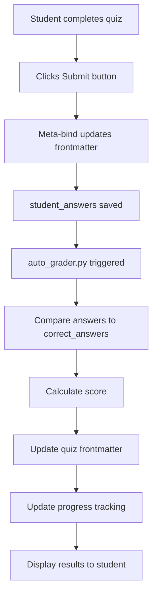

# Quiz Grading

**Purpose:** Detailed documentation of multiple choice quiz auto-grading

**Last Updated:** 2025-11-06  
**OCDS Version:** 1.0.0

---

## 📋 Overview

Quiz grading in OCDS is **fully automated** for multiple choice questions. The system instantly grades quizzes when students submit, provides immediate feedback, tracks attempts, and handles retakes according to configured policies.

---

## 🎯 Quiz Grading Process

### Step-by-Step Flow



---

## 📝 Grading Logic

### Basic Grading Algorithm

```python
def grade_quiz(quiz_file: Path) -> Dict[str, Any]:
    """Grade a multiple choice quiz."""
    
    frontmatter = parse_frontmatter(quiz_file)
    
    questions = frontmatter['questions']
    student_answers = frontmatter['student_answers']
    
    correct = 0
    total = len(questions)
    results = []
    
    for i, question in enumerate(questions):
        student_answer = student_answers[i]
        correct_answer = question['correct_answer']
        
        is_correct = (student_answer == correct_answer)
        
        if is_correct:
            correct += 1
        
        results.append({
            'question_id': question['id'],
            'student_answer': student_answer,
            'correct_answer': correct_answer,
            'is_correct': is_correct
        })
    
    score = (correct / total) * 100
    
    return {
        'score': score,
        'correct_answers': correct,
        'total_questions': total,
        'percentage': score,
        'results': results,
        'graded_date': datetime.now().strftime('%Y-%m-%d %H:%M:%S')
    }
```

---

## 🔄 Retake Policies

### Retake Configuration

```yaml
# grading_config.yaml
quiz_grading:
  allow_retakes: true
  max_attempts: 3
  score_method: best  # best, average, last
  retake_delay: 0     # Hours between attempts (0 = no delay)
  show_correct_answers: false  # After first attempt
```

### Scoring Methods

**1. Best Score (Default)**
```python
# Take highest score from all attempts
attempts = [75, 85, 80]
final_score = max(attempts)  # 85%
```

**2. Average Score**
```python
# Average all attempts
attempts = [75, 85, 80]
final_score = sum(attempts) / len(attempts)  # 80%
```

**3. Last Attempt**
```python
# Use most recent score
attempts = [75, 85, 80]
final_score = attempts[-1]  # 80%
```

---

## 📊 Question Types

### Multiple Choice (Single Answer)

```yaml
- id: q1
  type: multiple_choice
  text: "Which tongue color indicates Heat?"
  options:
    - id: A
      text: "Pale"
    - id: B
      text: "Red"
    - id: C
      text: "Purple"
    - id: D
      text: "Blue"
  correct_answer: B
  points: 1
```

**Grading:** Exact match required (B = B)

---

### Multiple Choice (Multiple Answers)

```yaml
- id: q2
  type: multiple_choice_multiple
  text: "Which patterns involve Qi Deficiency? (Select all that apply)"
  options:
    - id: A
      text: "Spleen Qi Deficiency"
    - id: B
      text: "Lung Qi Deficiency"
    - id: C
      text: "Liver Blood Stagnation"
    - id: D
      text: "Heart Qi Deficiency"
  correct_answers: [A, B, D]
  points: 2
```

**Grading:** All correct answers must be selected, no incorrect answers

---

### True/False

```yaml
- id: q3
  type: true_false
  text: "A pale tongue always indicates Cold."
  correct_answer: false
  points: 1
```

**Grading:** Boolean match

---

## 🎯 Partial Credit

### Configuration

```yaml
quiz_grading:
  allow_partial_credit: true
  partial_credit_rules:
    multiple_choice_multiple: true  # Partial credit for multi-select
    essay: false                    # No partial credit (manual grading)
```

### Partial Credit Calculation

```python
def calculate_partial_credit(student_answers: List[str], 
                            correct_answers: List[str],
                            points: int) -> float:
    """Calculate partial credit for multiple-answer questions."""
    
    correct_selected = len(set(student_answers) & set(correct_answers))
    incorrect_selected = len(set(student_answers) - set(correct_answers))
    total_correct = len(correct_answers)
    
    # Award points for correct, deduct for incorrect
    earned = (correct_selected / total_correct) - (incorrect_selected / total_correct)
    earned = max(0, earned)  # No negative scores
    
    return earned * points

# Example:
# Correct: [A, B, D]
# Student: [A, B, C]
# Points: 2

# correct_selected = 2 (A, B)
# incorrect_selected = 1 (C)
# total_correct = 3

# earned = (2/3) - (1/3) = 0.33
# final_points = 0.33 * 2 = 0.67 points
```

---

## 📈 Score Tracking

### Quiz Frontmatter After Grading

```yaml
---
ocds_type: quiz
material_id: quiz_week01
class_id: TCM_101
week: 1

title: "Week 1 Quiz: Tongue Diagnosis"
questions: 10
points_possible: 10

# Attempt tracking
attempts: 2
max_attempts: 3

# Attempt 1
attempt_1:
  submitted_date: 2025-01-05 14:30:00
  score: 75
  correct_answers: 7.5
  time_spent: 12  # minutes

# Attempt 2
attempt_2:
  submitted_date: 2025-01-06 10:15:00
  score: 85
  correct_answers: 8.5
  time_spent: 10

# Best score
score: 85
correct_answers: 8.5
total_questions: 10
percentage: 85.0
graded_date: 2025-01-06 10:15:00
score_method: best

# Student answers (latest attempt)
student_answers:
  - B
  - A
  - C
  - D
  - B
  - A
  - C
  - B
  - D
  - A
---
```

---

## 🔍 Answer Feedback

### Immediate Feedback (After Submission)

```markdown
## Quiz Results

**Score:** 85% (8.5/10 correct)

### Question-by-Question Results

1. ✅ **Correct** - Which tongue color indicates Heat?
   - Your answer: B (Red)
   - Correct!

2. ✅ **Correct** - A pale tongue indicates...
   - Your answer: A (Qi/Blood Deficiency)
   - Correct!

3. ❌ **Incorrect** - Which coating color indicates Cold?
   - Your answer: C (Yellow)
   - Correct answer: A (White)
   - Explanation: Yellow coating indicates Heat, not Cold.

[... remaining questions ...]
```

---

## 🎯 Quiz Analytics

### Individual Quiz Statistics

```dataviewjs
const quiz = dv.current();

dv.paragraph(`
**Quiz Statistics:**
- Attempts: ${quiz.attempts}/${quiz.max_attempts}
- Best Score: ${quiz.score}%
- Average Score: ${quiz.attempt_scores.reduce((a,b) => a+b) / quiz.attempts}%
- Time Spent: ${quiz.total_time_spent} minutes
- Improvement: ${quiz.score - quiz.attempt_1.score}%
`);
```

### Class-Wide Quiz Statistics

```dataview
TABLE
  avg(score) as "Class Average",
  min(score) as "Lowest",
  max(score) as "Highest",
  avg(attempts) as "Avg Attempts"
FROM "Classes/TCM_101/Materials"
WHERE ocds_type = "quiz" AND week = 1
```

---

## 🎯 Best Practices

### For Instructors

**Writing Good Quiz Questions:**
- ✅ **Clear wording** - No ambiguous questions
- ✅ **Plausible distractors** - Wrong answers should be tempting
- ✅ **Avoid "all of the above"** - Makes questions too easy
- ✅ **Test one concept** - Don't combine multiple ideas
- ✅ **Consistent difficulty** - Mix easy, medium, hard

**Setting Retake Policies:**
- ✅ **Allow retakes** - Encourages learning from mistakes
- ✅ **Limit attempts** - 2-3 attempts is reasonable
- ✅ **Use best score** - Rewards improvement
- ✅ **Consider delays** - Optional cooldown between attempts

---

### For Students

**Taking Quizzes:**
- ✅ **Read carefully** - Don't rush
- ✅ **Eliminate wrong answers** - Process of elimination
- ✅ **Review materials first** - Don't guess blindly
- ✅ **Use all attempts** - Retake to improve score
- ✅ **Learn from mistakes** - Review incorrect answers

---

## 📚 Related Documentation

- [[Auto_Grading_Overview.md]] - Overall grading system
- [[Quiz_Template.md]] - Quiz file format
- [[Question_Bank_Schema.md]] - Question format
- [[auto_grader.py.md]] - Grading script

---

*Last updated: 2025-11-06*  
*OCDS Version: 1.0.0*
