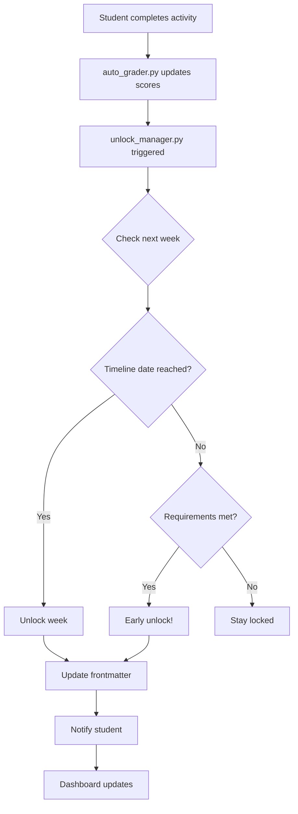

# Progression Logic

**Purpose:** Complete documentation of content unlocking logic in OCDS

**Last Updated:** 2025-11-06  
**OCDS Version:** 1.0.0

---

## 📋 Overview

Progression logic in OCDS determines **when students can access new content**. Unlike traditional time-based systems, OCDS uses a **hybrid approach** combining timeline dates with performance-based unlocking, allowing flexible pacing while maintaining structure.

---

## 🎯 Unlock Strategies

### 1. Timeline-Based (Traditional)

**How it works:** Content unlocks on scheduled dates

```yaml
# timeline.yaml
weeks:
  - week: 1
    unlock_date: 2025-01-01
  - week: 2
    unlock_date: 2025-01-08
  - week: 3
    unlock_date: 2025-01-15
```

**Pros:**
- ✅ Predictable pacing
- ✅ Good for cohort-based learning
- ✅ Prevents students from rushing

**Cons:**
- ❌ Fast learners must wait
- ❌ Slow learners feel rushed
- ❌ One-size-fits-all approach

---

### 2. Performance-Based (Mastery)

**How it works:** Content unlocks when requirements met

```yaml
# timeline.yaml
weeks:
  - week: 2
    unlock_requirements:
      - material_id: quiz_week01
        min_score: 70
      - material_id: task_week01
        min_completion: 80
```

**Pros:**
- ✅ Flexible pacing
- ✅ Rewards high performers
- ✅ Ensures mastery before advancing

**Cons:**
- ❌ Students may rush
- ❌ Cohort loses synchronization
- ❌ Struggling students may get stuck

---

### 3. Hybrid (Recommended)

**How it works:** Unlock when EITHER timeline date OR requirements met

```python
def check_unlock(week: int, student_id: str) -> bool:
    """Check if week should unlock (hybrid logic)."""
    
    timeline_date = get_unlock_date(week)
    requirements = get_unlock_requirements(week)
    
    # Option 1: Timeline date reached
    if datetime.now() >= timeline_date:
        return True
    
    # Option 2: Requirements met (early unlock)
    if check_requirements_met(student_id, requirements):
        return True
    
    return False
```

**Pros:**
- ✅ Best of both worlds
- ✅ Fast learners can advance early
- ✅ Slow learners have deadline
- ✅ Maintains some cohort structure

**Cons:**
- ⚠️ More complex to configure
- ⚠️ Requires clear communication

---

## 🔧 Unlock Requirements

### Requirement Types

**1. Quiz Score**
```yaml
unlock_requirements:
  - material_id: quiz_week01
    min_score: 70
```

**2. Task Completion**
```yaml
unlock_requirements:
  - material_id: task_week01
    min_completion: 80  # 80% of tasks
```

**3. Homework Submission**
```yaml
unlock_requirements:
  - material_id: hw_week01
    status: submitted  # Just submitted, not graded
```

**4. Flashcard Review**
```yaml
unlock_requirements:
  - material_id: flashcards_week01
    min_reviews: 20  # Reviewed 20 cards
```

**5. Multiple Requirements (AND logic)**
```yaml
unlock_requirements:
  - material_id: quiz_week01
    min_score: 70
  - material_id: task_week01
    min_completion: 80
  # Both must be met
```

---

## 🔄 Unlock Process Flow



---

## 📊 Unlock Logic Implementation

### Core Function

```python
def check_and_unlock_weeks(class_id: str, student_id: str):
    """Check all weeks and unlock if requirements met."""
    
    timeline = load_timeline(class_id)
    progress = load_progress(class_id, student_id)
    current_week = progress['current_week']
    
    # Check next week
    next_week = current_week + 1
    
    if next_week > len(timeline['weeks']):
        return  # No more weeks
    
    week_data = timeline['weeks'][next_week - 1]
    
    # Check timeline date
    unlock_date = week_data.get('unlock_date')
    if unlock_date and datetime.now() >= parse_date(unlock_date):
        unlock_week(class_id, student_id, next_week, reason='timeline')
        return
    
    # Check requirements
    requirements = week_data.get('unlock_requirements', [])
    if check_requirements_met(student_id, requirements):
        unlock_week(class_id, student_id, next_week, reason='performance')
        return


def check_requirements_met(student_id: str, requirements: List[Dict]) -> bool:
    """Check if all unlock requirements are met."""
    
    for req in requirements:
        material_id = req['material_id']
        material = load_material(material_id)
        
        # Check quiz score
        if 'min_score' in req:
            if material.get('score', 0) < req['min_score']:
                return False
        
        # Check task completion
        if 'min_completion' in req:
            if material.get('completion_percentage', 0) < req['min_completion']:
                return False
        
        # Check submission status
        if 'status' in req:
            if material.get('submission_status') != req['status']:
                return False
        
        # Check flashcard reviews
        if 'min_reviews' in req:
            if material.get('reviews_completed', 0) < req['min_reviews']:
                return False
    
    return True  # All requirements met


def unlock_week(class_id: str, student_id: str, week: int, reason: str):
    """Unlock a week for a student."""
    
    progress_file = f'Classes/{class_id}/Progress/{student_id}_progress.yaml'
    progress = load_yaml(progress_file)
    
    # Update current week
    progress['current_week'] = week
    
    # Record unlock
    progress['weeks'][week] = {
        'unlocked': True,
        'unlock_date': datetime.now().strftime('%Y-%m-%d'),
        'unlock_reason': reason,  # 'timeline' or 'performance'
        'status': 'in_progress'
    }
    
    save_yaml(progress_file, progress)
    
    # Update material frontmatter
    week_dir = f'Classes/{class_id}/Materials/Week_{week:02d}'
    for material_file in Path(week_dir).glob('*.md'):
        update_frontmatter(material_file, {
            'unlocked': True,
            'unlock_date': datetime.now().strftime('%Y-%m-%d')
        })
    
    # Notify student
    notify_unlock(student_id, class_id, week, reason)
```

---

## 🎯 Early Unlock Threshold

### High Performer Bonus

```yaml
# grading_config.yaml
unlock_settings:
  enable_early_unlock: true
  early_unlock_threshold: 90  # 90% score
  early_unlock_weeks_ahead: 1  # Can unlock 1 week early
```

**Logic:**
```python
def check_early_unlock(student_id: str, week: int) -> bool:
    """Check if student qualifies for early unlock."""
    
    config = load_grading_config()
    
    if not config['unlock_settings']['enable_early_unlock']:
        return False
    
    threshold = config['unlock_settings']['early_unlock_threshold']
    
    # Check previous week score
    prev_week_score = get_week_average(student_id, week - 1)
    
    if prev_week_score >= threshold:
        return True
    
    return False
```

---

## 🚫 Blocking vs. Flagging

### OCDS Philosophy: Flag, Don't Block

**Traditional approach (blocking):**
```
Student scores 60% on quiz
→ Week 2 stays locked
→ Student stuck, frustrated
→ May give up
```

**OCDS approach (flagging):**
```
Student scores 60% on quiz
→ Week 2 unlocks on schedule
→ Student flagged for review
→ Instructor offers support
→ Student continues learning
```

**Implementation:**
```python
def check_and_flag_student(student_id: str, week: int):
    """Flag struggling students without blocking."""
    
    week_score = get_week_average(student_id, week)
    
    if week_score < 60:
        flag_for_review(student_id, week, severity='high')
    elif week_score < 70:
        flag_for_review(student_id, week, severity='medium')


def flag_for_review(student_id: str, week: int, severity: str):
    """Flag student for instructor review."""
    
    flag_data = {
        'student_id': student_id,
        'week': week,
        'severity': severity,
        'flagged_date': datetime.now().strftime('%Y-%m-%d'),
        'reason': 'Low performance',
        'resolved': False
    }
    
    # Add to instructor dashboard
    add_to_review_queue(flag_data)
    
    # Notify instructor
    notify_instructor(flag_data)
```

---

## 📈 Unlock Analytics

### Student Unlock History

```dataview
TABLE
  week as "Week",
  unlock_date as "Unlocked",
  unlock_reason as "Reason",
  days_to_complete as "Days"
FROM "Classes/TCM_101/Progress"
WHERE student_id = "john_doe"
SORT week ASC
```

### Class Unlock Statistics

```dataviewjs
const students = dv.pages('"Classes/TCM_101/Progress"');

const earlyUnlocks = students.filter(s => 
  s.weeks.some(w => w.unlock_reason === 'performance')
).length;

const onTimeUnlocks = students.filter(s =>
  s.weeks.every(w => w.unlock_reason === 'timeline')
).length;

dv.paragraph(`
**Unlock Statistics:**
- Early unlocks: ${earlyUnlocks} students
- On-time unlocks: ${onTimeUnlocks} students
- Average unlock speed: ${calculateAvgSpeed()} days/week
`);
```

---

## 🎯 Best Practices

### For Instructors

**Setting Unlock Requirements:**
- ✅ **Reasonable thresholds** - 70% is standard
- ✅ **Multiple paths** - Don't require perfection
- ✅ **Clear communication** - Explain unlock logic
- ✅ **Test with data** - Simulate student progress
- ✅ **Allow flexibility** - Enable early unlock

**Monitoring Unlocks:**
- ✅ **Track early unlocks** - Identify high performers
- ✅ **Watch for flags** - Support struggling students
- ✅ **Adjust if needed** - Requirements too hard/easy?
- ✅ **Communicate changes** - Give students notice

---

### For Students

**Understanding Unlocks:**
- ✅ **Check requirements** - Know what's needed
- ✅ **Track progress** - Monitor dashboard
- ✅ **Plan ahead** - Don't wait until deadline
- ✅ **Ask for help** - If stuck, reach out
- ✅ **Aim for early unlock** - Challenge yourself

---

## 📚 Related Documentation

- [[unlock_manager.py.md]] - Unlock script
- [[Flexible_Pacing.md]] - Pacing strategies
- [[Review_Flags.md]] - Student support system
- [[Timeline_Schema.md]] - Timeline configuration

---

*Last updated: 2025-11-06*  
*OCDS Version: 1.0.0*
