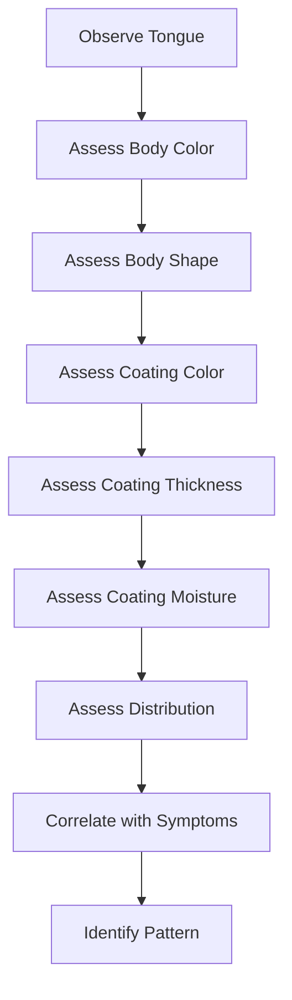

<!-- slide bg="TCM_Points_Images/BL-1_chinese.png" -->

# Introduction to Tongue Diagnosis

**TCM 101 - Week 1**

Dr. Jane Smith  
January 8, 2025
>
---

## Learning Objectives

By the end of this lecture, you will be able to:

1. Identify the major areas of the tongue <!-- .element: class="fragment" -->
2. Describe tongue body characteristics <!-- .element: class="fragment" -->
3. Analyze tongue coating features <!-- .element: class="fragment" -->
4. Correlate tongue findings with TCM patterns <!-- .element: class="fragment" -->

Note: Emphasize that tongue diagnosis is ONE tool among many. Never diagnose from tongue alone.

---

## Why Tongue Diagnosis?

<!-- slide-column: 0.5 -->

### Advantages

- ✅ Non-invasive
- ✅ Immediate information
- ✅ Reflects internal conditions
- ✅ Changes over time

<!-- slide-column: 0.5 -->

### Limitations

- ❌ Can be influenced by food/drink
- ❌ Requires good lighting
- ❌ Must consider full picture
- ❌ Individual variations

Note: Always ask patient about recent food/drink, medications, smoking

---

<!-- slide bg="#1a1a2e" -->

# Part 1: Tongue Anatomy

---

## Tongue Areas and Organ Correspondence

- **Tip:** Heart, Lungs
- **Center:** Spleen, Stomach
- **Root:** Kidneys, Bladder
- **Sides:** Liver, Gallbladder

Note: This is the traditional mapping. Some practitioners use different systems.

---

## Normal Tongue Characteristics

<!-- slide-column: 0.6 -->

<!-- slide-column: 0.4 -->

### Features

- **Color:** Pale red
- **Shape:** Not too thick/thin
- **Coating:** Thin, white
- **Moisture:** Slightly moist
- **Movement:** Flexible

Note: Show multiple examples of "normal" - there's variation!

---

<!-- slide bg="#1a1a2e" -->

# Part 2: Tongue Body

---

## Tongue Body Color

### Pale Tongue

**Indicates:** Qi/Blood/Yang Deficiency <!-- .element: class="fragment" -->

**Common patterns:** Spleen Qi Deficiency, Blood Deficiency <!-- .element: class="fragment" -->

Note: Pale = lack of warmth, energy, or blood nourishment

---

## Tongue Body Color

### Red Tongue

**Indicates:** Heat <!-- .element: class="fragment" -->

**Common patterns:** Yin Deficiency, Excess Heat <!-- .element: class="fragment" -->

Note: Distinguish between excess heat (bright red) and deficiency heat (darker red)

---

## Tongue Body Color

### Purple/Blue Tongue

**Indicates:** Blood Stasis, Cold <!-- .element: class="fragment" -->

**Common patterns:** Blood Stasis, Cold Obstruction <!-- .element: class="fragment" -->

Note: Purple-blue = cold stasis, Purple-red = heat with stasis

---

## Tongue Body Shape

| Shape | Indicates | Example Pattern |
|-------|-----------|-----------------|
| **Thin** | Deficiency | Blood/Yin Deficiency |
| **Swollen** | Dampness, Qi Deficiency | Spleen Qi Deficiency |
| **Stiff** | Internal Wind, Heat | Liver Wind |
| **Deviated** | Wind-Stroke | Post-stroke |
| **Cracked** | Yin Deficiency, Heat | Stomach Yin Deficiency |

Note: Shape changes develop slowly - indicates chronic conditions

---

## Tongue Body Shape Examples

<!-- slide-column: 0.33 -->

### Thin Tongue

Blood/Yin Deficiency

<!-- slide-column: 0.33 -->

### Swollen Tongue

Dampness, Qi Deficiency

<!-- slide-column: 0.33 -->

### Cracked Tongue

Yin Deficiency

---

<!-- slide bg="#1a1a2e" -->

# Part 3: Tongue Coating

---

## What is Tongue Coating?

<!-- slide-column: 0.5 -->

<!-- slide-column: 0.5 -->

### Coating Reflects:

- **Stomach Qi** (normal thin white)
- **Pathogenic factors** (thick, colored)
- **Progression of disease** (changes over time)

**Key principle:** Coating = condition of Stomach/Spleen and presence of pathogens

Note: Coating can change quickly - reflects acute conditions

---

## Coating Thickness

### Thin Coating (Normal)

- Can see tongue body through coating
- Indicates: Normal Stomach Qi

---

## Coating Thickness

### Thick Coating

- Cannot see tongue body
- Indicates: Pathogenic factor (Dampness, Phlegm, Food Stagnation)

Note: Thicker = more severe or deeper pathogen

---

## Coating Color

| Color | Indicates | Example Pattern |
|-------|-----------|-----------------|
| **White** | Cold, Exterior | Wind-Cold, Dampness |
| **Yellow** | Heat | Damp-Heat, Stomach Heat |
| **Gray** | Interior Heat/Cold | Chronic condition |
| **Black** | Extreme Heat/Cold | Severe, advanced disease |

Note: Color progression: white → yellow → gray → black (increasing severity)

---

## Coating Color Examples

<!-- slide-column: 0.5 -->

### White Coating

Cold pattern or exterior condition

<!-- slide-column: 0.5 -->

### Yellow Coating

Heat pattern (internal or excess)

---

## Coating Moisture

<!-- slide-column: 0.33 -->

### Normal Moisture

Slightly moist

<!-- slide-column: 0.33 -->

### Dry Coating

Yin Deficiency, Heat

<!-- slide-column: 0.33 -->

### Wet/Slippery

Dampness, Yang Deficiency

---

## Coating Distribution

### Peeled Coating

**Indicates:** Stomach/Kidney Yin Deficiency <!-- .element: class="fragment" -->

**Location matters:** Where coating is missing indicates which organ <!-- .element: class="fragment" -->

Note: Peeled coating = Yin deficiency in corresponding organ area

---

<!-- slide bg="#1a1a2e" -->

# Part 4: Clinical Application

---

## Putting It All Together

### Case Study: 45-year-old Female

**Complaints:** Fatigue, poor appetite, loose stools

**Tongue:** Pale, swollen with tooth marks, thin white coating

**Analysis:** <!-- .element: class="fragment" -->
- Pale body = Qi/Yang Deficiency <!-- .element: class="fragment" -->
- Swollen with tooth marks = Spleen Qi Deficiency <!-- .element: class="fragment" -->
- Thin white coating = No pathogenic factor <!-- .element: class="fragment" -->

**Pattern:** Spleen Qi Deficiency <!-- .element: class="fragment" -->

Note: Walk through the logic step by step. Emphasize correlation with symptoms.

---

## Common Tongue Patterns

| Tongue Presentation | Pattern | Key Features |
|---------------------|---------|--------------|
| Pale, swollen, tooth marks | Spleen Qi Deficiency | Fatigue, poor appetite |
| Red, no coating | Yin Deficiency | Night sweats, dry mouth |
| Red tip | Heart Fire | Insomnia, anxiety |
| Purple body | Blood Stasis | Fixed pain, dark complexion |
| Thick yellow coating | Damp-Heat | Heavy sensation, yellow discharge |

---

## Tongue Diagnosis Workflow

